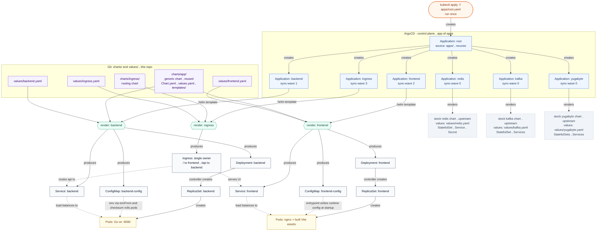

# SETUP.md — Kubernetes Deployment (ArgoCD + Helm, GitOps)

> **This is the ops repo.** It deploys a Go backend, a React/Vite frontend, and three
> off-the-shelf services (YugabyteDB, Kafka, Redis) to a Kubernetes cluster via ArgoCD.
> Git is the single source of truth — every change to the cluster is a commit.

**Mental model:**
`git push → ArgoCD root → child Applications → helm template → Kubernetes objects → ReplicaSets → Pods`

---

# ✅ Confirmed & Finalized

## Deployment model

GitOps via ArgoCD using the **app-of-apps** pattern. One `root` Application is applied by hand
once; it reads the `apps/` folder and creates one child `Application` per component. ArgoCD
renders each chart with **`helm template`** (not `helm install`) and reconciles the result against
the cluster. There is no Helm release living in the cluster, and `helm list` shows nothing — ArgoCD
owns state, not Helm.

## Component categories

| Category | Source | Config |
|---|---|---|
| Your services (backend, frontend) | one generic chart `charts/app` | per-app file in `values/` |
| Off-the-shelf infra (YugabyteDB, Kafka, Redis) | upstream community charts, **version-pinned** | `values/<name>.yaml` |
| Routing | dedicated `charts/ingress` chart | `values/ingress.yaml` |

## Ops repo structure

```text
my-platform/                      # the ops / GitOps repo (this repo)
├── apps/                         # ArgoCD Application manifests (plain YAML)
│   ├── root.yaml                 # app-of-apps — apply this ONE by hand, once
│   ├── yugabyte.yaml             # sync-wave 0
│   ├── redis.yaml                # sync-wave 0
│   ├── kafka.yaml                # sync-wave 0
│   ├── backend.yaml              # sync-wave 1
│   ├── frontend.yaml             # sync-wave 2
│   └── ingress.yaml              # sync-wave 3
│
├── charts/
│   ├── app/                      # ONE generic chart, reused by ALL your services + future projects
│   │   ├── Chart.yaml
│   │   ├── values.yaml           # safe defaults + every toggle (ingress.enabled, probes, command, volumes…)
│   │   └── templates/
│   │       ├── _helpers.tpl
│   │       ├── deployment.yaml
│   │       ├── service.yaml
│   │       ├── configmap.yaml
│   │       └── ingress.yaml      # only renders if .Values.ingress.enabled (off in this setup)
│   └── ingress/                  # routing chart — the SOLE owner of the shared Ingress
│       ├── Chart.yaml
│       ├── values.yaml
│       └── templates/
│           └── ingress.yaml      #  / → frontend Service,  /api → backend Service
│
└── values/                       # config ONLY — no templates here
    ├── backend.yaml              # consumed by charts/app
    ├── frontend.yaml             # consumed by charts/app
    ├── ingress.yaml              # consumed by charts/ingress
    ├── yugabyte.yaml             # override values for the upstream chart
    ├── redis.yaml
    └── kafka.yaml
```

> The generic `charts/app` *can* render its own per-host Ingress (handy for other projects), but in
> this setup routing is centralised in `charts/ingress`, so `backend.yaml` and `frontend.yaml` set
> `ingress.enabled: false`.

## Flow diagram



**Legend:** purple = files in Git · blue = ArgoCD Applications · green = the `helm template` render step ·
grey = rendered Kubernetes objects · yellow = running Pods · dashed grey = collapsed stock services.
Solid arrows = "creates / produces"; dotted arrows = runtime relationships.

## Setup steps

1. Create this repo with the structure above.
2. Build the generic chart `charts/app` — Deployment, Service, ConfigMap, and an optional gated Ingress. Keep it generic so it is reusable across services and future projects.
3. Build `charts/ingress` — the single Ingress that routes `/` → frontend and `/api` → backend.
4. Write `values/<component>.yaml` for everything. For the three upstream charts, **pin the chart version** and **repoint container images off the deprecated Bitnami catalog** (see rationale below).
5. Write one ArgoCD `Application` per component in `apps/`, each carrying a `sync-wave` annotation. Use **multi-source** so the chart and its values file (which live in different folders of this repo) resolve cleanly.
6. Write `apps/root.yaml` (app-of-apps) pointing at `apps/` with `directory.recurse: true`.
7. In ArgoCD: register this Git repo (Settings → Repositories), plus any upstream Helm repos / OCI registries you reference.
8. Bootstrap once: `kubectl apply -f apps/root.yaml`. ArgoCD creates everything in wave order.
9. Verify in the ArgoCD UI (each app **Synced + Healthy**). From here on, change anything by editing Git and pushing.

## Canonical ArgoCD Application (multi-source + sync wave)

Every one of your services is this same file with a different `name`, `sync-wave`, and values path.

```yaml
# apps/backend.yaml
apiVersion: argoproj.io/v1alpha1
kind: Application
metadata:
  name: backend
  namespace: argocd
  annotations:
    argocd.argoproj.io/sync-wave: "1"        # infra is 0, frontend 2, ingress 3
spec:
  project: default
  sources:
    - repoURL: https://github.com/you/my-platform.git
      targetRevision: main
      path: charts/app                        # the ONE generic chart
      helm:
        valueFiles:
          - $values/values/backend.yaml       # ← resolved from the ref source below
    - repoURL: https://github.com/you/my-platform.git
      targetRevision: main
      ref: values                             # names this source "values"
  destination:
    server: https://kubernetes.default.svc
    namespace: myapp
  syncPolicy:
    automated: { prune: true, selfHeal: true }
    syncOptions:
      - CreateNamespace=true
```

The generic chart renders its Ingress only when asked, so the same chart serves apps with and without one:

```yaml
# charts/app/templates/ingress.yaml
{{- if .Values.ingress.enabled }}            # false for backend/frontend in this setup
apiVersion: networking.k8s.io/v1
kind: Ingress
# ...
{{- end }}
```

## Finalized decisions

- **One generic chart, per-app values.** `charts/app` is reused by every service and copy-pasted into future projects; each app is just a values file. Build chart-per-entity only when an entity genuinely needs different *templates*, not just different values.
- **Multi-source Applications** (`$values` ref) so the chart and its values file can live in different folders of the same repo. (Alternative: inline the config under `helm.valuesObject`, or `values: |` on older ArgoCD, and drop the `values/` files.)
- **One host = one Ingress = one owner.** Routing lives in `charts/ingress`; app charts set `ingress.enabled: false`. Never let two charts emit an Ingress for the same host.
- **Deploy order via sync waves:** operators `-1` → stateful infra (yugabyte/redis/kafka) `0` → backend `1` → frontend `2` → ingress `3`. ArgoCD waits for every resource in a wave to be **Healthy** before the next wave.
- **Design for convergence, not hard ordering.** Readiness probes + app-level retry/backoff; transient `CrashLoopBackOff` self-heals. Use an `initContainer` only for a true hard gate (e.g. DB migration).
- **Pin all upstream chart versions** and override image registries away from the deprecated Bitnami public catalog.
- **Config flow:** backend reads its ConfigMap via `envFrom`, with a `checksum/config` annotation that rolls pods on config change. Frontend reads runtime config written by its container entrypoint (or avoids the problem with same-origin `/api` routing).
- **Secrets:** never commit plaintext. Use **Sealed Secrets** (encrypted blobs safe for Git) or the **External Secrets Operator** (pulls from Vault / a cloud secret manager).

---

# 📝 Essence of the Discussion (background & rationale)

The reasoning behind the decisions above, distilled.

- **ArgoCD is not `helm install`.** It runs `helm template` to render plain manifests, then applies and continuously reconciles them. Consequence: no Helm release in the cluster, `helm list` is empty, ArgoCD is the source of truth. Most Helm hooks still map onto ArgoCD sync phases.

- **You don't "find" a chart for your own code.** Third-party charts exist for off-the-shelf software only. For your Go/React code you template it yourself (`helm create`, trimmed) or use a generic app chart — which is why we landed on one shared `charts/app`.

- **The Bitnami sourcing change matters.** The public Bitnami catalog was deprecated: images moved to an unpatched `bitnamilegacy` repo, and the full catalog now sits behind the paid "Bitnami Secure" subscription. So "Kafka/Redis charts are already available" is true, but the safe sources changed. For this stack: official **`yugabytedb/yugabyte`** chart; **Strimzi operator** for Kafka; **Chainguard's Bitnami fork** or a Redis operator for Redis. Pin versions and override image references regardless.

- **Choosing which values to override.** `helm show values <repo>/<chart> --version X.Y.Z` is the authoritative source (the Artifact Hub page and README are summaries). Override only the subset that differs for you — typically `replicaCount`, `resources`, `persistence` (size/storageClass), auth, and the app-specific knobs — not the whole file. Preview with `helm template … -f your-values.yaml` before ArgoCD sees it.

- **Ingress ownership / "merge conflicts."** Two charts emitting an Ingress is **not** a Git merge conflict (different files in different charts). The real failure is at runtime: same name + namespace → both Applications claim the object and fight (permanent out-of-sync flapping); different names → the controller merges rules per host, which is fine for non-overlapping paths but flaky for overlapping paths or host-level settings (TLS, annotations). Hence: exactly one owner per host.

- **Ordering & runtime readiness are two different things.** Kubernetes has no `depends_on` between Deployments. Sync waves order the *deploy*, but a pod can still start while a dependency restarts later. The backend will boot whether or not Kafka is reachable; the right outcome is retry/backoff (or crash-and-restart until it answers). The **Ingress is not a startup dependency** — it just routes, returning 503 until backing pods are ready.

- **The Vite gotcha.** `import.meta.env.VITE_*` is baked into the bundle at **build time**, so setting an env var on a running frontend pod does nothing. A "configurable" SPA needs either runtime injection (entrypoint runs `envsubst` to write a `config.js` the app reads via `window.__ENV__`) or — simpler — same-origin `/api` routing via the Ingress so no backend URL is baked at all. This is also why the frontend's config story is an *image* concern, not a chart concern.

- **Why a generic chart works for both backend and frontend.** The only frontend-specific behaviour (the `config.js` entrypoint) lives in the frontend image; to the chart, the frontend is just another container reading env from a ConfigMap, exactly like the backend. So one chart covers both, and the per-app differences (image, ports, env, whether an Ingress renders) are all values. Graduate to a Helm **library chart** (`type: library`) only when apps need genuinely different templates.
