# Kubernetes Notes — Part 1: Foundations (Networking → Workloads → Ingress)

> **How to use:** every concept follows **Why → What → Diagram → Gotchas**. Interview questions are pooled at the end (§1.9) and link multiple concepts rather than repeating them. Cross-references use `§X.Y` (e.g. `§2.3` = Part 2, section 3). Diagrams are inline mermaid.

**Contents:** 1.1 Networking concepts · 1.2 Cluster architecture · 1.3 Pods · 1.4 Labels/Selectors/Namespaces · 1.5 ReplicaSets · 1.6 Deployments · 1.7 Services · 1.8 Ingress · 1.9 Interview questions

---

## 1.1 Networking concepts (the K8s-specific ones to revise)

> You already know OSI/TCP. These are the **networking concepts these notes assume** — the ones that actually appear in K8s.

| Concept | One-liner | Where it shows up |
|---|---|---|
| **Flat pod network** | Every Pod gets its own cluster-wide IP; any Pod can reach any Pod, no NAT | §1.3 |
| **CNI** (Container Network Interface) | The plugin that *implements* that network (Calico, Cilium, Flannel) | cluster setup |
| **kube-proxy** | Programs the node so a Service's virtual IP forwards to real Pod IPs (modes: iptables / IPVS / nftables) | §1.7 |
| **CoreDNS** | In-cluster DNS: `service.namespace.svc.cluster.local` | §1.7 |
| **L4 vs L7** | Service = L4 (TCP/UDP); Ingress = L7 (HTTP host/path) | §1.7, §1.8 |
| **North-south vs east-west** | In/out of the cluster vs Pod-to-Pod | diagram below |
| **NetworkPolicy** | L3/L4 firewall *between* Pods (default = everything allowed) | security |
| **Gateway API** | The newer, GA successor to Ingress | §1.8 |

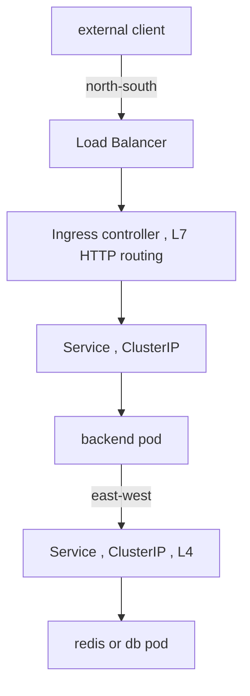

**Gotchas:** Ingress is *only* north-south HTTP — it never touches Pod-to-Pod traffic. All internal service-to-service goes through ClusterIP + DNS. NetworkPolicy is opt-in; without it everything can talk to everything.

---

## 1.2 Cluster architecture (short)

**Why:** to know *who acts* when you apply a manifest. **What:** a control plane (decides) + worker nodes (run the work), all driven by a reconcile loop.

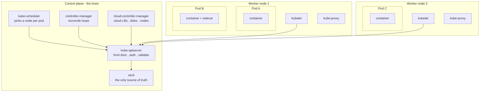

| Component | Job | Why it exists |
|---|---|---|
| **kube-apiserver** | The only thing that talks to etcd; all reads/writes go through it | single, audited entry point |
| **etcd** | Stores desired + actual state | durable cluster memory |
| **scheduler** | Assigns Pods → nodes (by resources, affinity, taints) | placement decisions |
| **controller-manager** | Runs reconcile loops (Deployment, RS, node, etc.) | makes reality match desired |
| **kubelet** | On each node: starts containers, reports health | node-level executor |
| **kube-proxy** | Implements Service networking on the node | turns Service VIP → Pod IPs |

**The declarative reconcile loop** — the single most important idea in K8s:

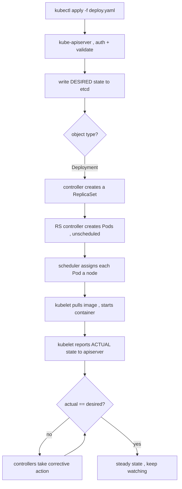

**Gotchas:** you never tell K8s *how* — you declare *what* and controllers converge. Nothing bypasses the apiserver. etcd is the source of truth; lose it, lose the cluster state.

---

## 1.3 Pods

**Why:** the smallest deployable unit; a wrapper for one or more containers that must **share fate, network, and storage**. **What:** containers in a Pod share one IP (talk over `localhost`) and can share volumes.

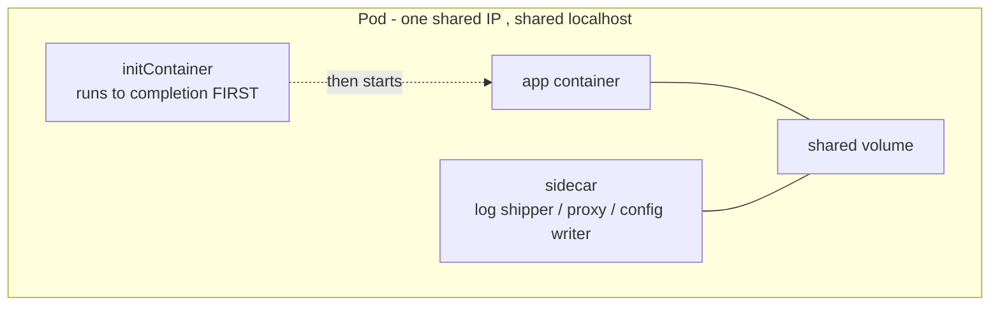

**Lifecycle + restart logic:**

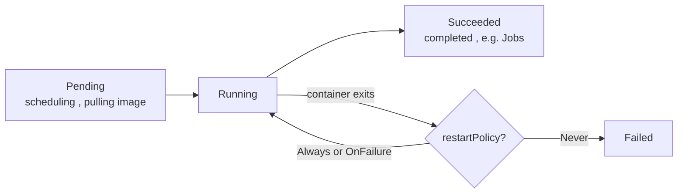

**Gotchas:** Pods are **ephemeral and mortal** — never create them directly in prod; let a controller (§1.6) own them. One IP per Pod, not per container. Common multi-container patterns: **init** (setup before main), **sidecar** (helper alongside main — e.g. the frontend `config.js` writer from our earlier discussion).

---

## 1.4 Labels, Selectors, Namespaces

**Why:** labels are the **glue**; selectors are how controllers and Services *find* the Pods they manage; namespaces partition a cluster. **What:** key/value tags + queries over them.

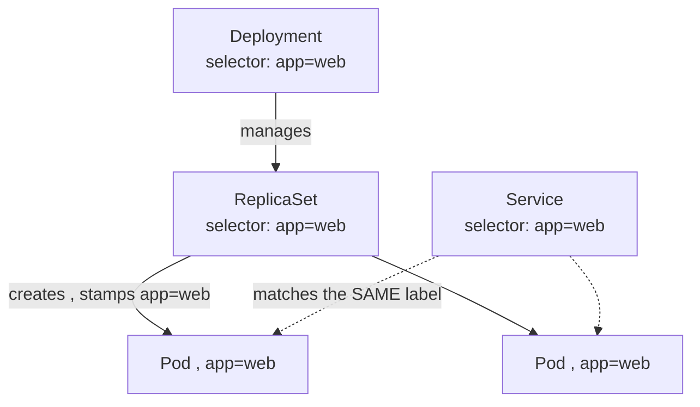

**Gotchas:** a Service finds Pods by the **same label** the Deployment stamps — mismatch = no endpoints = no traffic (a top interview trap, §1.9). A Deployment's `selector` is **immutable**. Namespaces are scoping/quota boundaries, **not** security boundaries by themselves (you still need RBAC + NetworkPolicy).

---

## 1.5 ReplicaSets

**Why:** keep exactly **N identical Pods** alive (self-healing). **What:** a controller that watches Pod count and corrects it.

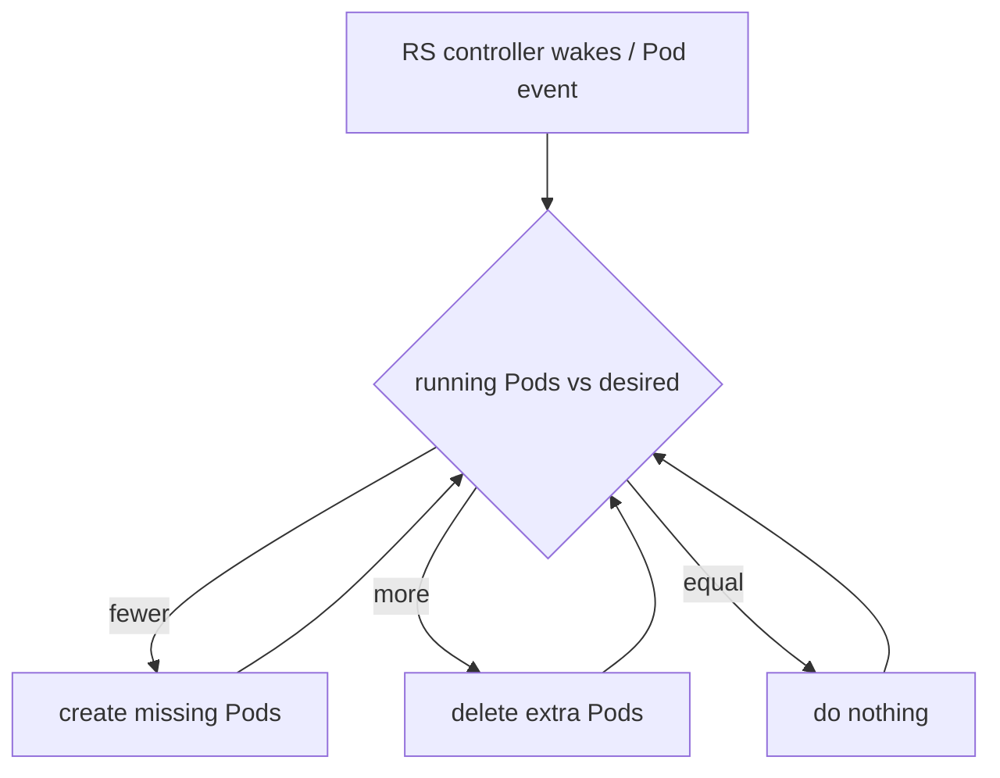

**Gotchas:** you almost never create an RS directly — a Deployment manages it for you (§1.6). RS owns its Pods via `ownerReferences`; delete a Pod and the RS recreates it.

---

## 1.6 Deployments

**Why:** RS alone can't do **rollouts/rollbacks**. A Deployment manages *versioned* ReplicaSets to give you zero-downtime updates and history. **What:** Deployment → (active + old) ReplicaSets → Pods.

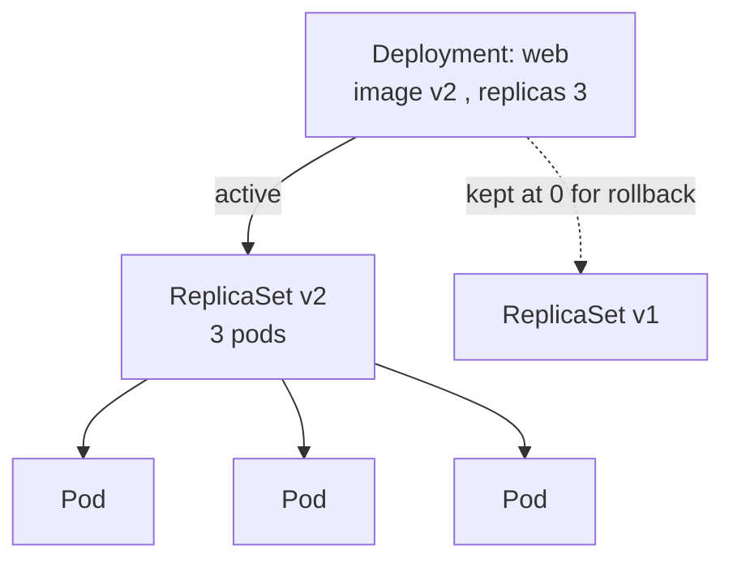

**Rolling update logic (zero-downtime):**

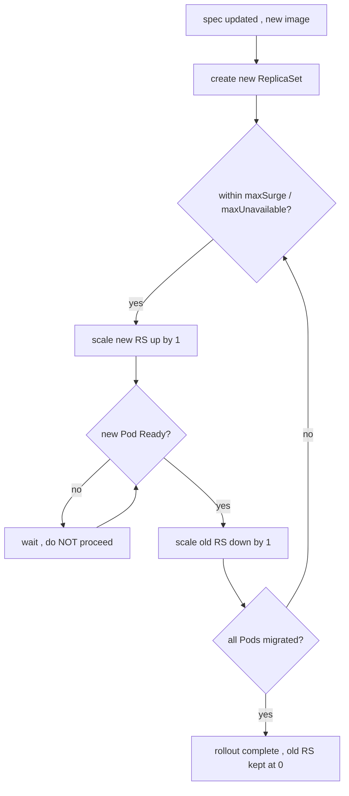

**Gotchas:** the **readiness probe** (§2.3) gates each step — no probe means traffic hits not-ready Pods. Tune `maxSurge`/`maxUnavailable`. Rollback with `kubectl rollout undo`; old RSs are retained per `revisionHistoryLimit`. Strategies: `RollingUpdate` (default) vs `Recreate` (kill all, then start — causes downtime).

---

## 1.7 Services

**Why:** Pods are ephemeral with **changing IPs** — you can't hardcode them. A Service gives a **stable virtual IP + DNS name + load balancing** over a changing set of Pods. **What:** a selector → a live list of healthy Pod endpoints, fronted by a fixed VIP.

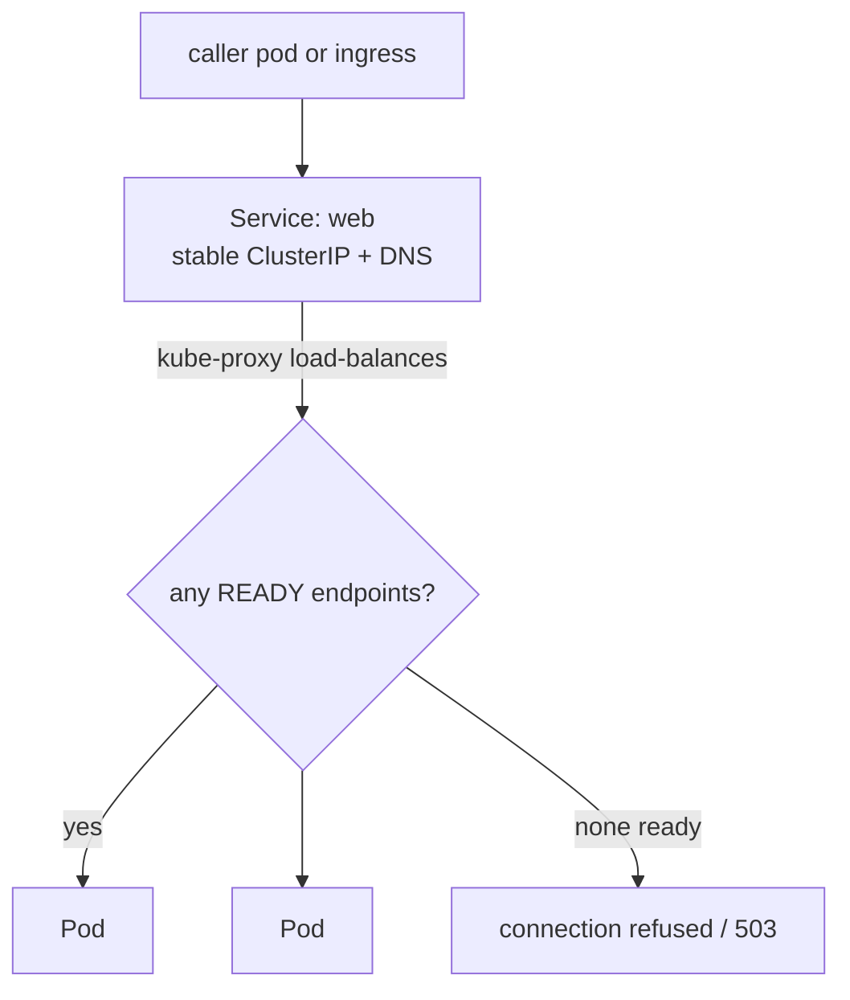

| Type | Reachable from | Use case |
|---|---|---|
| **ClusterIP** (default) | inside cluster only | internal service-to-service |
| **NodePort** | `NodeIP:port` | dev/debug; building block under LB |
| **LoadBalancer** | external, via cloud LB | expose **one** TCP service externally |
| **Headless** (`clusterIP: None`) | direct per-Pod DNS | StatefulSets / DBs (§2.4) |
| **ExternalName** | DNS CNAME | alias an external host |

**How the types layer** (each builds on the previous):

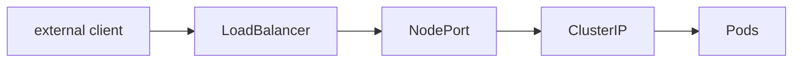

**Gotchas:** ClusterIP is **L4** — it has no idea about HTTP paths (that's Ingress, §1.8). Only **Ready** Pods (readiness probe, §2.3) appear in the endpoint list. Use the DNS name, never the VIP. Headless gives stable identity for stateful workloads.

---

## 1.8 Ingress

**Why:** a `LoadBalancer` Service per app means **many cloud LBs** and only L4. Ingress gives **one entry point**, **L7 host/path routing**, and **TLS termination** — many HTTP services behind one LB. **What:** *rules* (the Ingress object) executed by a *proxy* (the Ingress controller).

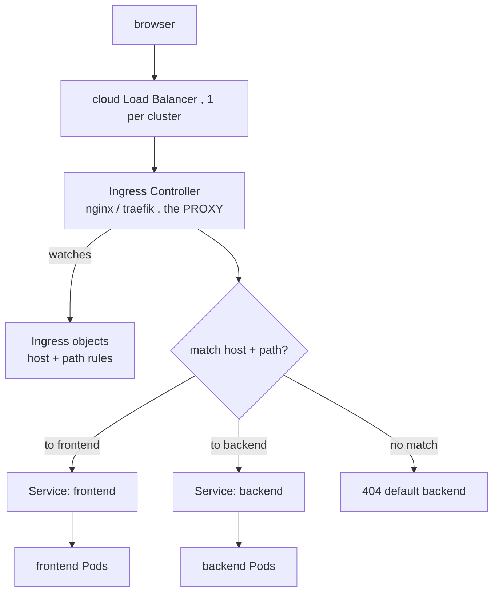

| Thing | What it is |
|---|---|
| **Ingress object** | The *rules* (data): host/path → Service. Inert on its own. |
| **Ingress controller** | The *engine*: a proxy that watches all Ingress objects and routes. **One per cluster.** |
| **Service** | What the rules point at; does the L4 hop to Pods. |

**Gotchas:** an Ingress object with **no controller installed does nothing**. Ingress is **HTTP(S)/L7 only** — raw TCP (DBs, Kafka) doesn't belong here (§1.7 LoadBalancer/headless instead). **One host = one Ingress owner** to avoid ownership fights (§3.2). **Gateway API** is the GA successor — more expressive, role-split (infra vs app teams); Ingress is essentially frozen.

---

## 1.9 Interview questions (synthesis — links multiple concepts)

**Q1. Trace a packet from an external browser to a specific container.**
Browser → cloud LB → Ingress **controller** Pod → matches an Ingress **rule** (host+path, §1.8) → target **Service** ClusterIP (§1.7) → **kube-proxy** DNATs to a healthy **Pod endpoint** (§1.1) → container. North-south the whole way.

**Q2. A Pod is `Running` but clients get nothing through its Service. Causes?**
Service **selector ≠ Pod labels** (§1.4); **readiness probe failing** so the Pod isn't an endpoint (§2.3 + §1.7); **wrong `targetPort`**; a **NetworkPolicy** blocking it (§1.1). "Running" ≠ "in the endpoint list."

**Q3. You delete a Pod owned by a Deployment — then delete its ReplicaSet. What happens?**
RS controller recreates the Pod (§1.5). Delete the RS → the **Deployment** recreates the RS *and* its Pods (§1.6). Ownership chain Deployment → RS → Pod, all driven by the reconcile loop (§1.2).

**Q4. Why is a Pod IP unsafe to depend on, and what does K8s give you instead?**
Pods are ephemeral; IPs change on reschedule (§1.3). Use the **Service ClusterIP** (stable VIP), the **CoreDNS name** (§1.1), and **label-selector** discovery (§1.4) — three layers that survive Pod churn.

**Q5. How does a rolling update stay zero-downtime, and what silently breaks it?**
New RS scales up while old scales down within `maxSurge`/`maxUnavailable` (§1.6); the **readiness probe** decides when a new Pod joins the Service's endpoints (§1.7, §2.3). Breaks when the readiness probe is missing or too lenient → the Service routes to Pods that aren't actually ready.

**Q6. ClusterIP vs NodePort vs LoadBalancer vs Ingress — when, and how do they relate?**
They *layer*: LoadBalancer → NodePort → ClusterIP → Pods (§1.7). Use **ClusterIP** internally, **Ingress** for HTTP at the edge (many apps, one LB, L7), **LoadBalancer** for non-HTTP/TCP at the edge. NodePort is mostly a building block.

**Q7. Difference between an Ingress and an Ingress Controller — and what if there's no controller?**
Object = rules (data); controller = the proxy that executes them (engine), one per cluster (§1.8). With no controller installed, the Ingress object exists but **nothing routes** — it's inert.

**Q8. Where do the control plane and a worker node each act during `kubectl apply`?**
apiserver validates + writes desired state to etcd; controllers create RS/Pods; scheduler places them; the node's **kubelet** pulls images and runs containers and reports back; **kube-proxy** wires Service traffic (§1.2). Control plane *decides*, node *executes*.
