# Kubernetes Notes — Part 2: Config, Scaling, Extensibility, GitOps

> Same format as Part 1: **Why → What → Diagram → Gotchas**, interview questions pooled at the end (§2.8). Cross-refs use `§X.Y` (`§1.x` = Part 1, `§3.x` = Part 3). Current as of 2026 (K8s 1.35, ArgoCD v3.x).

**Contents:** 2.1 ConfigMaps · 2.2 Secrets · 2.3 Reliability & Scaling · 2.4 Other Workloads + Storage · 2.5 CRDs/CRs/Operators · 2.6 ArgoCD / GitOps · 2.7 Virtual Clusters · 2.8 Interview questions

---

## 2.1 ConfigMaps

**Why:** keep config **out of the image** so one image runs in every environment (the whole "configurable backend" idea). **What:** a key/value object injected into Pods three ways.

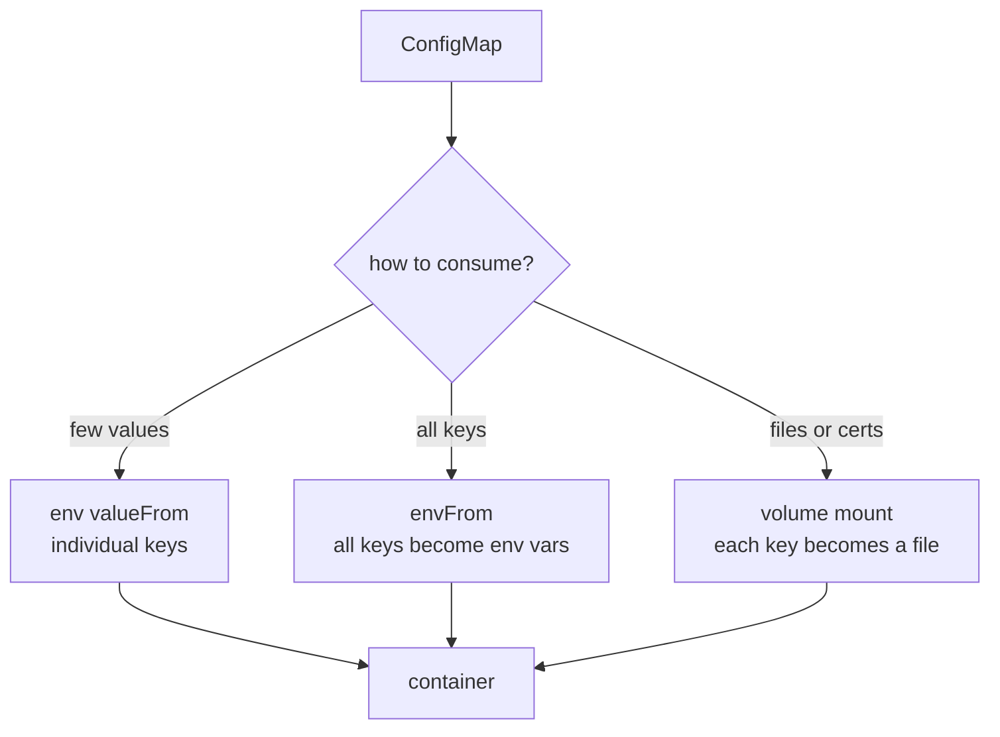

**The classic gotcha — "I changed the ConfigMap, nothing happened":**

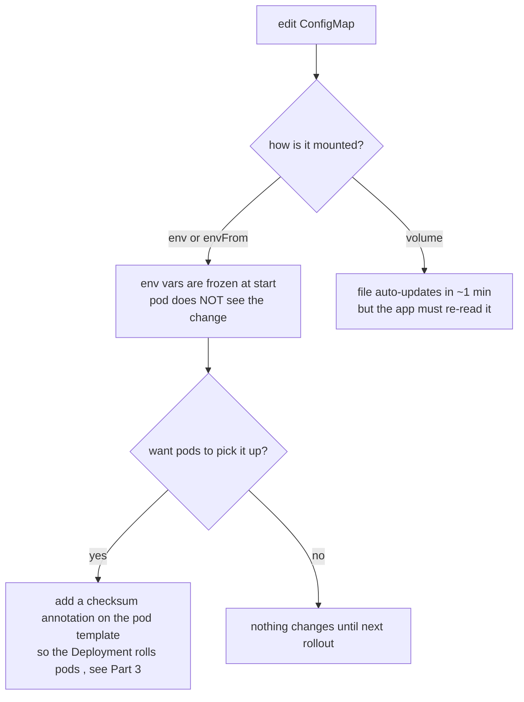

**Gotchas:** env-injected config is fixed for the Pod's life — only a rollout updates it. Volume-mounted config files update live but your app has to watch/reload them. The `checksum/config` annotation (§3) is the standard way to force a rollout on change. ConfigMaps are **not** secret and **not** for large blobs (1 MiB limit).

---

## 2.2 Secrets

**Why:** same as ConfigMaps but for sensitive values; lets you control RBAC and encryption separately. **What:** base64-encoded key/value objects (Opaque, `kubernetes.io/dockerconfigjson` for registry creds, `kubernetes.io/tls` for certs).

**Where secrets come from in GitOps** (you never commit plaintext):

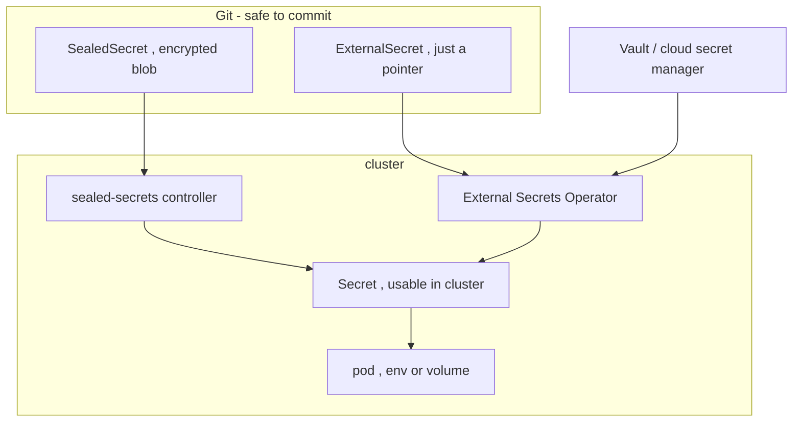

**Gotchas:** **base64 ≠ encryption** — anyone with read access decodes it instantly. Turn on **encryption at rest** for etcd. Prefer **Sealed Secrets** (encrypted, safe in Git) or **External Secrets Operator** (syncs from Vault/cloud) over raw Secrets. Use `imagePullSecrets` for private registries. Mounting as a file is generally safer than env (env can leak via crash dumps / child processes).

---

## 2.3 Reliability & Scaling

### 2.3.1 Requests, Limits & QoS

**Why:** the scheduler needs to know how much to reserve (**requests**) and the node needs a cap (**limits**). These also decide who gets killed first under pressure.

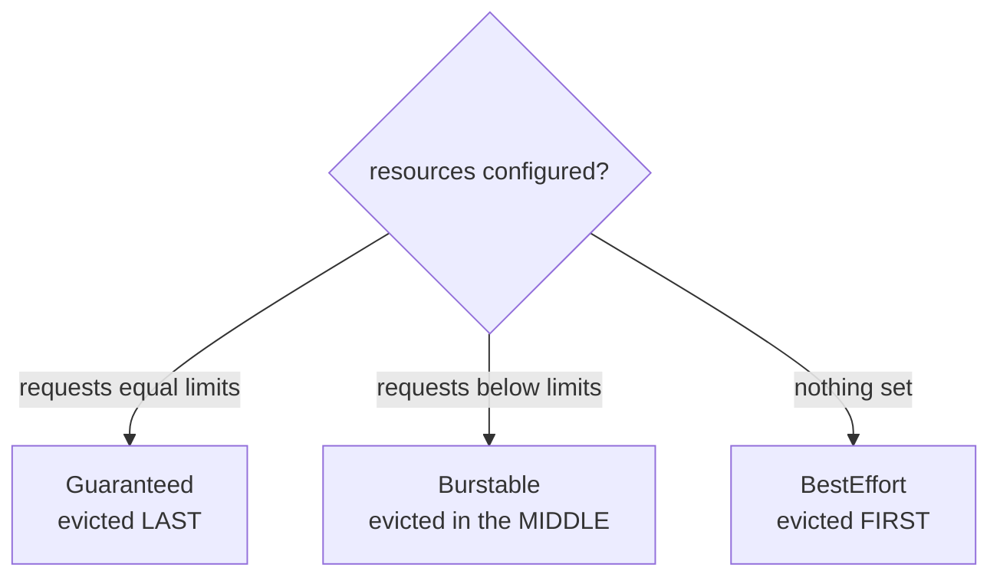

**Gotchas:** **requests** drive scheduling + the HPA percentage baseline; **limits** cause throttling (CPU) or OOM-kill (memory). No requests → BestEffort → first to die. Memory has no "throttle" — over the limit = killed.

### 2.3.2 Probes (liveness / readiness / startup)

**Why:** K8s can't know if your process is *healthy* or *ready* — probes tell it. Each probe does a **different** thing:

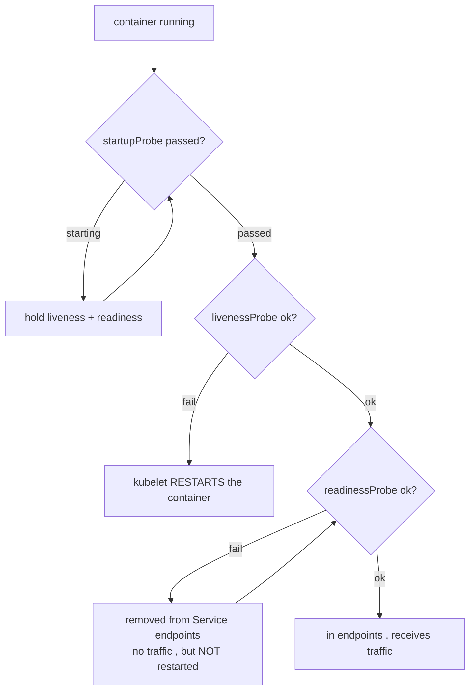

**Gotchas:** **liveness** = restart on failure; **readiness** = gate traffic (no restart); **startup** = protect slow boots from premature liveness kills. A liveness probe that checks a *dependency* (DB) causes cascading restarts when the dependency blips — don't. Readiness is what makes rolling updates (§1.6) zero-downtime.

### 2.3.3 HPA — Horizontal Pod Autoscaler (more pods)

**Why:** match replica count to load. **What:** `autoscaling/v2` controller adjusts a Deployment's replicas from CPU / memory / custom / external metrics.

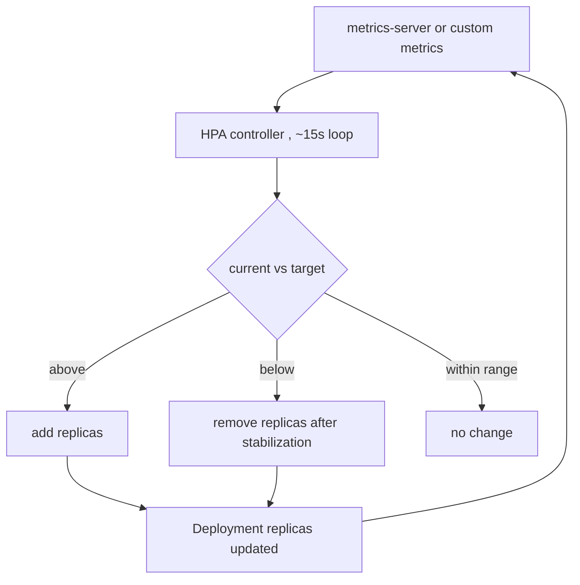

**Gotchas:** needs **metrics-server** (or an adapter). Set **requests** or CPU-percent targets are meaningless. Scale-down has a stabilization window (default ~5 min) to avoid flapping. Min/max replicas bound it.

### 2.3.4 VPA — Vertical Pod Autoscaler (bigger pods)

**Why:** right-size CPU/memory **requests** when adding replicas won't help (or for stateful singletons). **What:** a separate add-on that recommends and optionally applies resource changes.

| Mode | Behaviour |
|---|---|
| `Off` | recommend only (most common — read it, set requests by hand) |
| `Initial` | set requests at Pod creation |
| `Recreate` | evict + recreate to apply (disruptive) |
| `InPlace` / `InPlaceOrRecreate` | **(K8s 1.35 GA + VPA 1.2+)** resize a running Pod **without eviction** |

**Gotchas:** **never run HPA and VPA on the same metric** (both fighting over CPU) — use HPA on a custom metric (e.g. RPS) and VPA on CPU/mem, or keep VPA in `Off`. In-place resize needs **cgroup v2**; CPU/memory only (not ephemeral storage).

### 2.3.5 Node autoscaling — Cluster Autoscaler vs Karpenter (more nodes)

**Why:** pods can't schedule if no node has room. **What:** add/remove nodes based on pending pods.

| | Cluster Autoscaler | Karpenter |
|---|---|---|
| Model | scales predefined node groups / ASGs | provisions right-sized nodes directly via cloud API |
| Speed | minutes | ~1 minute |
| Packing | leaves fragmentation | bin-packs + consolidates idle nodes |
| Best for | multi-cloud, steady workloads | AWS-native, bursty/spot, cost-sensitive (v1.0 GA) |

**The three scaling axes together:**

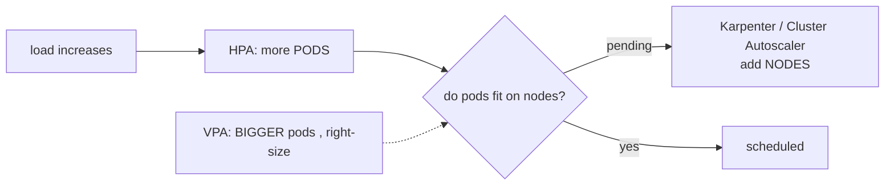

**Gotcha — thundering herd:** HPA can create pods faster than nodes appear; that gap (minutes on CA) means degraded service. Karpenter's faster provisioning narrows it.

---

## 2.4 Other Workloads + Storage

| Workload | What | Use case / why |
|---|---|---|
| **Deployment** (§1.6) | stateless, interchangeable pods | web/API tiers |
| **StatefulSet** | stable identity + storage, ordered | DBs, Kafka, anything with peers/state |
| **DaemonSet** | exactly one pod per node | log/metrics agents, CNI, node tools |
| **Job** | run to completion | migrations, batch |
| **CronJob** | scheduled Jobs | backups, reports |

**StatefulSet anatomy** (why DBs use it):

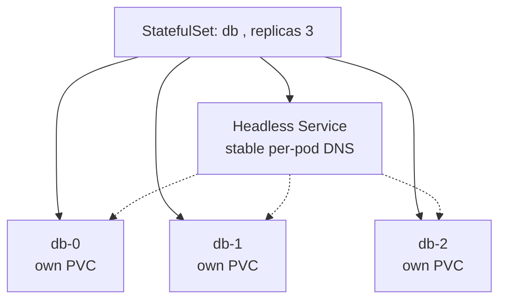

**Storage — how a volume gets provisioned:**

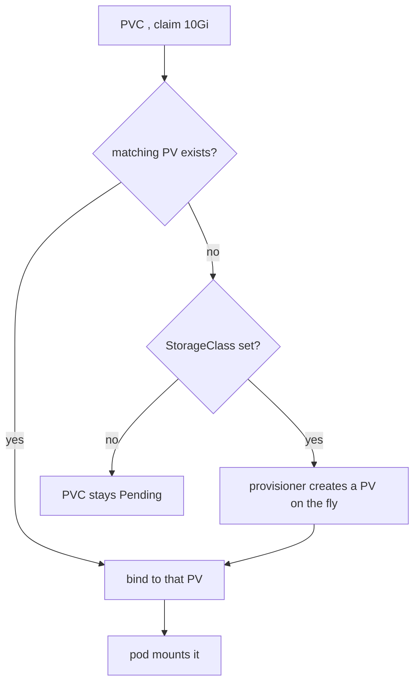

**Gotchas:** StatefulSet needs a **headless Service** and uses `volumeClaimTemplates` (one PVC per pod — they are **not** shared). Ordered scale-up/down (db-0 before db-1). **PV** = the real disk, **PVC** = the request, **StorageClass** = the dynamic-provisioning recipe. `ReadWriteOnce` (one node) vs `ReadWriteMany` (shared) matters for what you can mount where.

---

## 2.5 CRDs, CRs & Operators

**Why:** extend Kubernetes with **your own object types** and teach the cluster to manage complex software (a DB cluster, Kafka) the way it manages built-ins. **What:** CRD = new *kind*; CR = an *instance*; Operator = a controller that reconciles that CR.

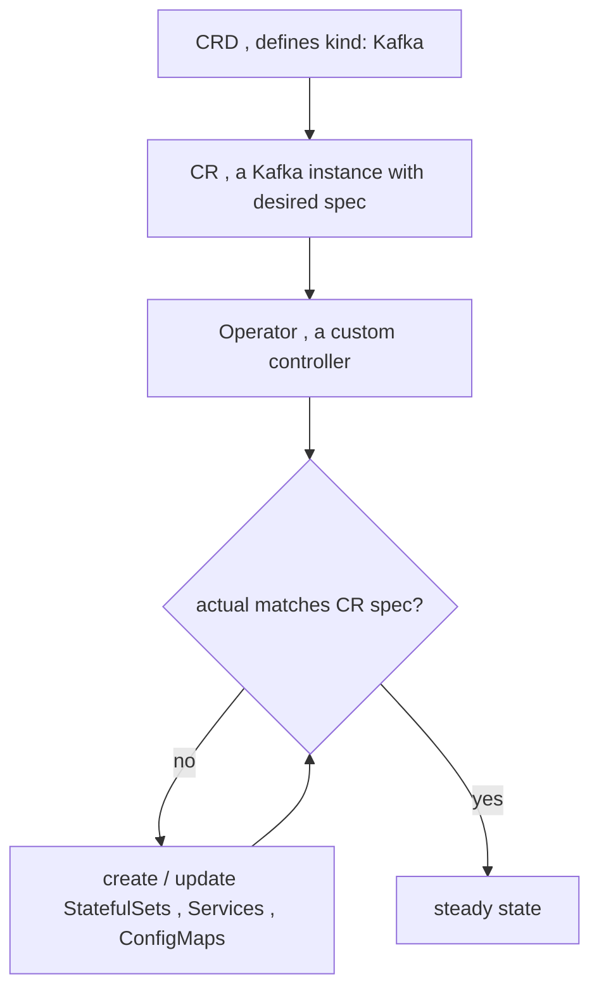

**Gotchas:** an Operator is just the §1.2 reconcile loop applied to *your* domain logic (failover, backups, rebalancing) — things a static Helm chart can't do. Examples: **Strimzi** (Kafka), **CloudNativePG** (Postgres), **cert-manager**, **Prometheus Operator**. CRDs are cluster-wide; versioning/upgrades of CRDs need care.

---

## 2.6 ArgoCD / GitOps

**Why:** make **Git the single source of truth** — declarative, versioned, auditable, and self-correcting — instead of running `kubectl`/`helm` by hand. **What:** a controller that continuously makes the cluster match a Git repo.

**Architecture:**

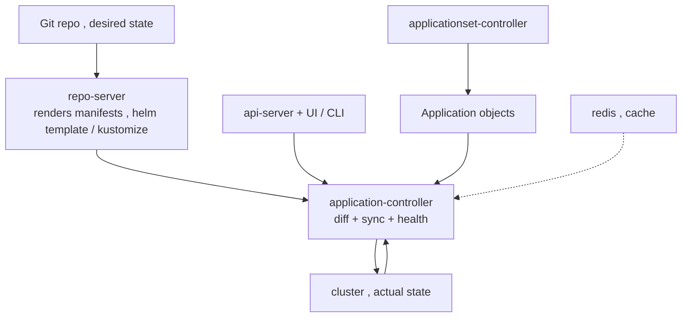

**The reconcile decision:**

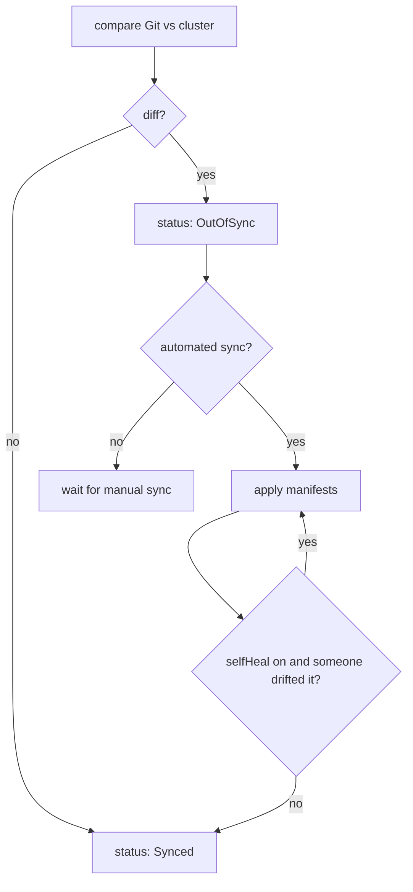

**Key concepts (interview-dense):**

| Concept | Point |
|---|---|
| `helm template` not `helm install` | ArgoCD renders + applies; no Helm release in cluster, `helm list` is empty (§3) |
| `source` vs `sources` | multi-source combines a chart + your values from another repo (`$values` ref); **last source wins** on duplicate resources (`RepeatedResourceWarning`) |
| **app-of-apps** | one root Application creates child Applications (§3.2) |
| **ApplicationSet** | templates many Applications from a generator (list, git, cluster) — multi-env / multi-cluster |
| **sync waves** | `argocd.argoproj.io/sync-wave` orders apply; waits for Healthy between waves |
| **hooks** | PreSync/Sync/PostSync (migrations, smoke tests) |
| `prune` + `selfHeal` | delete what's removed from Git; revert manual drift |
| **Projects + RBAC** | restrict which repos/clusters/namespaces an app may touch |

**Gotchas:** multi-source is **not** for grouping unrelated apps — use app-of-apps or ApplicationSet for that. Health for a multi-source app is computed for the whole app, not per source. ArgoCD is on the **v3.x** line now (older 3.1 etc. reaching EOL) — pin and upgrade deliberately.

---

## 2.7 Virtual Clusters (vcluster) & Multi-tenancy

**Why:** namespaces give **weak** isolation (shared API server, shared CRDs, no tenant cluster-admin); separate clusters give strong isolation but cost a lot. A **vcluster** is the middle ground. **What:** a real-but-virtual control plane (its own API server + datastore) running as pods inside one host namespace; a **syncer** pushes the actual workloads down to the host to run.

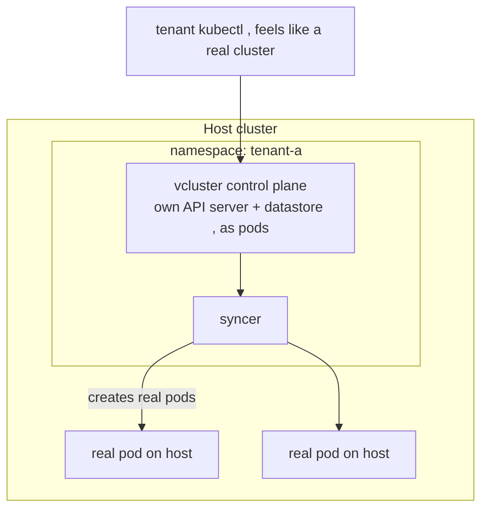

| Option | Isolation | Cost | Tenant gets |
|---|---|---|---|
| **Namespace** | weak | cheapest | a slice; shared API + CRDs |
| **vcluster** | strong-ish | low | own API server, own CRDs, cluster-admin |
| **Separate cluster** | strongest | highest | everything, hard blast-radius wall |

**Gotchas:** tenants can install **their own CRDs/operators** and have cluster-admin **without** affecting the host or each other — great for CI, previews, and per-team sandboxes. Pods really run on the host's nodes, so host capacity/network policy still applies.

---

## 2.8 Interview questions (synthesis — links multiple concepts)

**Q1. You changed a ConfigMap; the app didn't pick it up. Two reasons, two fixes.**
If injected via `env`/`envFrom`, values are frozen at start (§2.1) → fix with a `checksum/config` annotation to roll the Deployment (§1.6, §3). If volume-mounted, the file updates but the app must reload it → fix by watching the file or rolling.

**Q2. Liveness vs readiness — and a config that causes a cluster-wide outage.**
Liveness fail → restart; readiness fail → pulled from Service endpoints, no restart (§2.3.2, §1.7). Pointing a **liveness** probe at a shared dependency (DB) means one DB blip restarts every pod at once — a self-inflicted outage. Health-check only the process; gate dependencies with readiness.

**Q3. A node is under memory pressure. Which pods die first, and how do you protect a critical one?**
BestEffort first, then Burstable over their requests, Guaranteed last (§2.3.1). Protect the critical pod by setting `requests == limits` (Guaranteed) and a PodDisruptionBudget.

**Q4. HPA and VPA both target CPU. What breaks, and the right split?**
They oscillate — VPA changes requests while HPA scales on CPU% of those same requests (§2.3.3–4). Split them: HPA on a custom metric (RPS), VPA on CPU/mem (or `Off`). With K8s 1.35 in-place resize, VPA can right-size without evictions.

**Q5. Walk the three autoscaling layers when traffic spikes 10×.**
HPA adds pods (§2.3.3); if they go `Pending`, Karpenter/CA add nodes (§2.3.5); VPA right-sizes requests so packing stays efficient (§2.3.4). Risk: HPA outruns node provisioning (thundering herd) → degraded window until nodes arrive.

**Q6. Why deploy Kafka/Postgres via an Operator instead of a plain Helm chart?**
A chart renders static YAML once; an Operator (§2.5) encodes ongoing lifecycle — failover, rebalancing, backups, safe scaling of a StatefulSet (§2.4). Use a chart for stateless apps, an Operator (often itself installed by a chart) for stateful systems with real Day-2 logic.

**Q7. In ArgoCD, why is `helm list` empty, and how do you combine an upstream chart with your own values?**
ArgoCD runs `helm template` + applies — no release object exists (§2.6, §3). Combine via a multi-source Application: the upstream chart as one source, your values repo as a `ref` (`$values/...`), remembering last-source-wins on duplicates.

**Q8. A team needs cluster-admin and their own CRDs without risking prod. Namespace, vcluster, or new cluster?**
Namespace can't give cluster-admin or separate CRDs; a full cluster is overkill/costly. A **vcluster** (§2.7) gives them a real API server + CRDs + admin inside one host namespace, with workloads still running on shared nodes.
