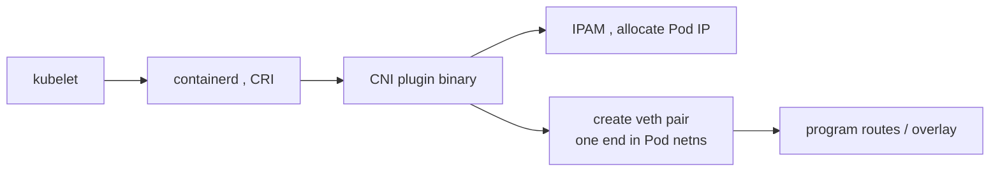

# CNI — how the flat Pod network actually gets built

Kubernetes ships **no** pod network of its own. It defines the contract — every Pod gets a unique IP, Pods reach each other without NAT — and delegates the implementation to a **CNI plugin**. Until one is installed, the kubelet reports the node `NotReady` because the network is unconfigured.

## The call path

When the kubelet wants to start a Pod, it asks the container runtime (containerd/CRI-O) to set up the sandbox. The runtime invokes the CNI binary in `/opt/cni/bin` with config from `/etc/cni/net.d`, passing the Pod's network namespace on stdin as JSON.

The plugin: (1) creates a **veth pair** — one end inside the Pod's netns as `eth0`, the other on the host; (2) asks **IPAM** for an address from the node's Pod CIDR; (3) wires cross-node reachability.

## How plugins differ on rule 3 (cross-node, no NAT)

| Plugin | Cross-node mechanism | Notes |
|---|---|---|
| **Flannel** (VXLAN) | encapsulate Pod packets in UDP overlay | simplest, small overhead |
| **Calico** | BGP routes Pod CIDRs between nodes, no overlay | fast; can do encap where needed |
| **Cilium** | eBPF programs in the kernel | can also replace [kube-proxy](deep:p1-kube-proxy) |

## Edge cases / failure modes

- **IP exhaustion:** each node gets a `/24` Pod CIDR (~254 IPs) by default; dense nodes can run dry → Pods stuck `ContainerCreating` with `failed to allocate IP`.
- **Plugin mismatch:** swapping CNIs on a live cluster without draining leaves stale routes; Pods on different nodes silently can't talk.
- **MTU:** overlays add headers; if the overlay MTU isn't lowered, large packets fragment or black-hole (symptom: small requests work, large responses hang).
- **NetworkPolicy support is a CNI feature**, not core K8s — Flannel alone ignores [NetworkPolicy](deep:p1-network-policy) objects entirely; Calico/Cilium enforce them.

## Interview angle
"Why is a brand-new node `NotReady`?" → no CNI plugin has configured the pod network yet. And know that NetworkPolicy is only enforced if your CNI implements it — a policy applied under Flannel is a no-op.
