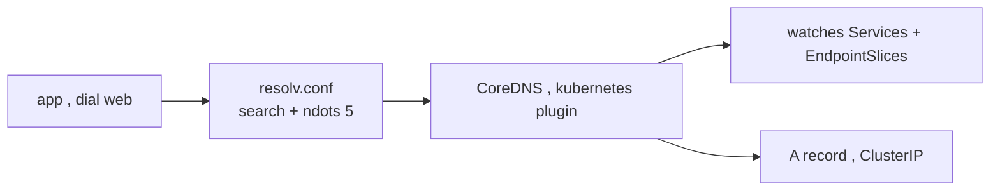

# CoreDNS — the in-cluster name resolver

CoreDNS is a Deployment (usually 2+ replicas, fronted by the `kube-dns` Service at a fixed ClusterIP like `10.96.0.10`) that answers DNS for the whole cluster. Every Pod's `/etc/resolv.conf` points its `nameserver` at that IP. The magic is the **`kubernetes` plugin**, which watches Services and [EndpointSlices](deep:p1-endpointslices) and synthesizes records on the fly — no zone files to edit.

## The names it serves

| Query | Returns |
|---|---|
| `web.shop.svc.cluster.local` | the `web` Service ClusterIP |
| `web` (from a Pod in `shop`) | same, via the `search` domain |
| headless Service (`clusterIP: None`) | A records for **each** Ready Pod IP |
| `_http._tcp.web.shop.svc...` | SRV record (port discovery) |
| StatefulSet pod | `pod-0.web.shop.svc.cluster.local` stable name (§2.4) |

## Why a short name resolves

The kubelet writes a `search` line into every Pod's `resolv.conf`:

```
search shop.svc.cluster.local svc.cluster.local cluster.local
nameserver 10.96.0.10
options ndots:5
```

So `web` is tried as `web.shop.svc.cluster.local` first. Cross-namespace, the short name fails — you must use the FQDN `web.<ns>.svc.cluster.local`.



## Failure modes / gotchas

- **`ndots:5`** means any name with fewer than 5 dots is treated as relative and walked through *all* search domains first. Querying an external host like `api.github.com` (2 dots) fires 4–5 failed lookups before the real one — measurable latency. Fix: append a trailing dot (`api.github.com.`) to force absolute.
- **CoreDNS down = cluster-wide outage** of name resolution, even though Pod IPs still route. Run it HA and watch its memory.
- **NodeLocal DNSCache** runs a per-node DNS cache to cut latency and conntrack pressure on the central CoreDNS.
- A [NetworkPolicy](deep:p1-network-policy) that forgets to allow egress to UDP/TCP **53** silently breaks all name resolution for the affected Pods.

## Interview angle
"Why does an external API call from a Pod seem slow?" — `ndots:5` causing failed search-domain expansions; or "why can app A resolve `db` but app B can't?" — B is in a different namespace and needs the FQDN.
