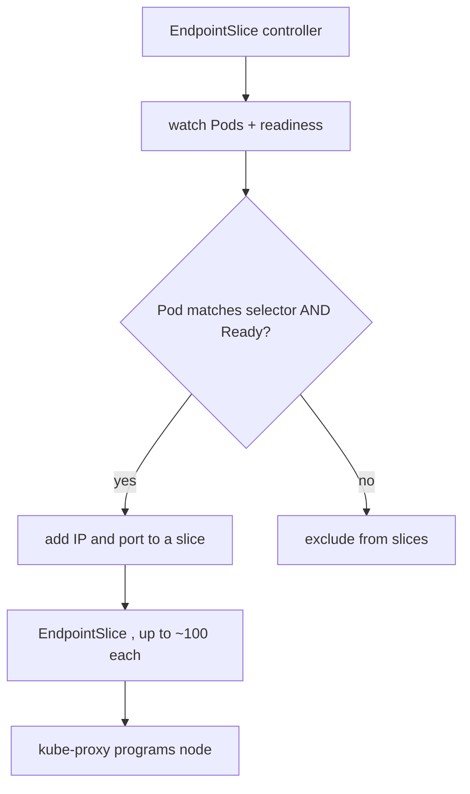

# EndpointSlices — what actually sits behind a Service

A Service's selector doesn't route packets. A controller turns "Pods matching this selector and currently **Ready**" into a list of IP:port targets, and **[kube-proxy](deep:p1-kube-proxy)** programs the node from that list. That list is stored in **EndpointSlice** objects.

## Endpoints → EndpointSlices (why the change)

The original `Endpoints` object stuffed *every* backend of a Service into **one** resource. For a 5,000-Pod Service, a single Pod change rewrote the whole object and pushed the full blob to every node's kube-proxy and every watcher — a control-plane storm at scale.

**EndpointSlices** shard that list into chunks (default cap 100 endpoints each). A Pod change now rewrites only its slice, so churn is proportional to the change, not to Service size. EndpointSlices are the default; `Endpoints` is kept (mirrored) only for backward compatibility.

## What's in a slice

Each endpoint carries the Pod IP, port, the **`conditions`** (`ready`, `serving`, `terminating`), the topology (node/zone — enabling **topology-aware routing** to prefer same-zone backends), and a `targetRef` back to the Pod.

The `serving` + `terminating` split matters: a terminating Pod can be `serving: true, ready: false` so it can finish **in-flight** connections during graceful shutdown (§[pod lifecycle](deep:p1-pod-lifecycle)) without receiving new ones.

## Failure modes / gotchas

- **Empty slice = 503 / connection refused.** Selector typo (§1.4) or all Pods failing [readiness](deep:p1-readiness-vs-liveness) → no endpoints → kube-proxy has nothing to DNAT to. `kubectl get endpointslices -l kubernetes.io/service-name=<svc>` is the fast diagnostic.
- **Only Ready Pods appear.** "Pod is Running" ≠ "Pod is in the slice."
- **`publishNotReadyAddresses: true`** (common on headless Services for StatefulSets) deliberately includes not-ready Pods so peers can discover each other during startup.
- **Propagation lag:** slice update → every node's kube-proxy must re-read; under heavy churn there's a brief window of stale routing.

## Interview angle
"You changed a label and traffic stopped" — selector no longer matches, slice went empty. "Why EndpointSlices over Endpoints?" — sharding so a single Pod change doesn't rewrite and re-push one giant object at scale; plus topology hints and the serving/terminating conditions for graceful drain.
