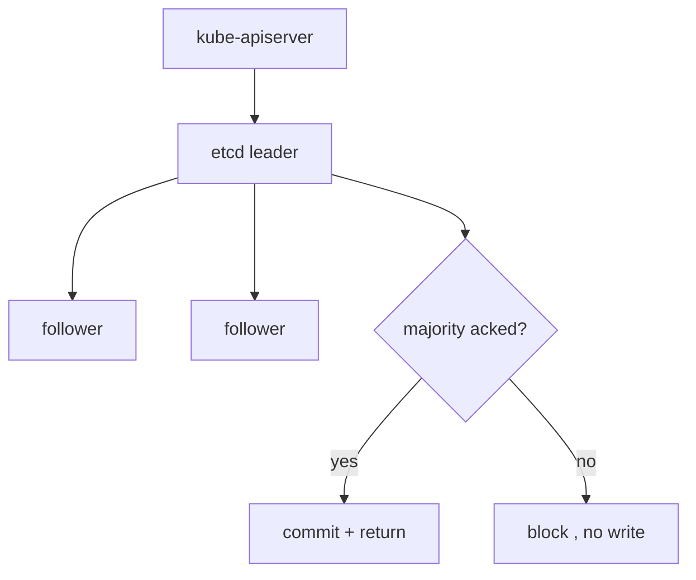

# etcd — the cluster's single source of truth

etcd is a distributed, consistent key/value store. It holds **all** cluster state: every Pod, Service, Secret, ConfigMap, and the desired/observed status of each. Only the **kube-apiserver** talks to it; everything else talks to the apiserver. Lose etcd without a backup and you lose the cluster.

## Why consistency, not availability

etcd uses the **Raft** consensus protocol. A write is committed only when a **majority (quorum)** of members persist it. This is a deliberate CP (consistent) choice from CAP: K8s would rather refuse a write than accept conflicting state.

**Quorum math:** with N members you tolerate `(N-1)/2` failures. So run **odd** counts — 3 members tolerate 1 loss, 5 tolerate 2. A 2-member cluster is *worse* than 1 (any single loss breaks quorum). Even numbers buy you nothing.

## How the watch model rides on etcd

Every key has a **revision** (a monotonic version). The apiserver exposes etcd's `watch` so controllers stream changes from a known revision — this is what powers the [reconcile loop](deep:p1-reconcile-loop) without polling. A `resourceVersion` you see on any K8s object is the underlying etcd revision.

## Operational edge cases

- **Compaction & defrag:** etcd keeps revision history; without periodic compaction the DB grows until it hits the space quota (default ~2–8 GiB) and goes **read-only** — a notorious cluster-wide outage. Compact + defrag on a schedule.
- **Secrets live here in plaintext** unless you enable **encryption at rest** (`EncryptionConfiguration`). Anyone with etcd access reads every Secret.
- **Latency sensitivity:** etcd wants fast `fsync`; slow disks (network EBS without enough IOPS) cause leader elections and apiserver timeouts.
- **Backup = `etcdctl snapshot save`.** Disaster recovery is restoring that snapshot; nothing else captures cluster state.

## Interview angle
"How many etcd nodes and why odd?" → quorum: `(N-1)/2` tolerance, even counts add cost without raising fault tolerance. "Where do Secrets live and are they safe?" → in etcd, base64 not encrypted *unless* you turn on encryption at rest.
