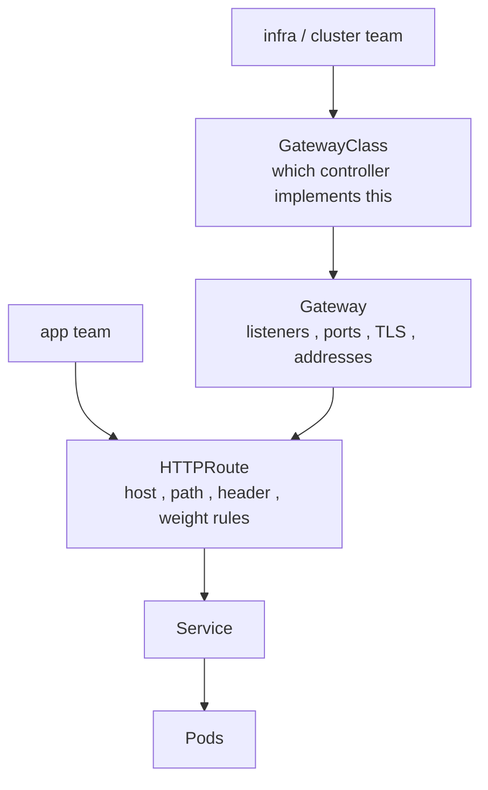

# Gateway API — the role-split successor to Ingress

Ingress (§1.8) packed host/path routing, TLS, and every advanced feature (via vendor annotations) into one object owned by one team. Gateway API replaces it with a **role-oriented** set of CRDs. Its core resources — `GatewayClass`, `Gateway`, `HTTPRoute` — reached **v1 GA in Gateway API v1.0 (Oct 2023)** and have matured steadily since. **Ingress is now in maintenance mode** (bug/security fixes only), so new L7 work should target Gateway API.

## The three roles, three resources



| Resource | Owner | Responsibility |
|---|---|---|
| `GatewayClass` | platform | picks the controller (like a StorageClass) |
| `Gateway` | infra/cluster team | the actual listener: ports, protocols, TLS certs |
| `HTTPRoute` / `GRPCRoute` / `TCPRoute` | app team | routing rules attached to a Gateway |

This split is the whole point: app teams ship routes without touching shared listener/TLS config, and the model is **portable** across implementations instead of annotation-locked.

## What it expresses natively (that Ingress needed annotations for)

- header/method/query-based matching
- **traffic splitting by weight** (canary: 90/10) directly in `HTTPRoute`
- request/response header mutation, redirects, mirroring
- **multi-protocol**: HTTP, gRPC, TLS, TCP, UDP routes
- **cross-namespace** route→Gateway attachment gated by `ReferenceGrant` (so a route can't hijack a Gateway it isn't allowed to use)

```yaml
kind: HTTPRoute
spec:
  parentRefs: [{ name: prod-gateway }]
  rules:
  - matches: [{ path: { type: PathPrefix, value: /api } }]
    backendRefs:
    - { name: api-v1, port: 80, weight: 90 }
    - { name: api-v2, port: 80, weight: 10 }
```

## Gotchas / interview angle
You still need a **controller** that implements the GatewayClass (nginx, Istio, Cilium, cloud) — the CRDs alone route nothing, same trap as a controller-less Ingress. Know the headline: Ingress = frozen/maintenance, Gateway API = GA and the recommended path; its killer features are role separation and built-in weighted traffic splitting without vendor annotations. Cross-namespace refs require an explicit `ReferenceGrant`.
