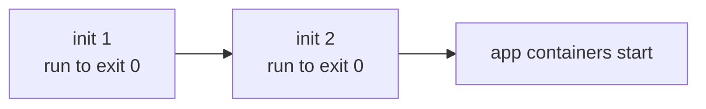

# Init vs sidecar containers — ordering and the native-sidecar fix

A Pod can carry helper containers in two shapes. The difference is **lifetime and ordering**, and a long-standing footgun was finally fixed with **native sidecars (GA in Kubernetes 1.33)**.

## Init containers

Listed under `initContainers`, they run **sequentially, to completion, before** any app container starts. Each must exit 0 or the Pod restarts the sequence. Use them for one-shot setup: run a DB migration, wait for a dependency, fetch a config, set kernel sysctls.



## Classic ("plain") sidecars and the bug

A plain sidecar was just a second container in `containers[]` — a proxy, log shipper, or config writer running **alongside** the app for the Pod's whole life. Two problems:

1. **No ordering.** All `containers[]` start together, so the app could start *before* its proxy/config sidecar was ready and fail early.
2. **Job pods never finish.** In a Job, the app container completes but the sidecar keeps running forever, so the Pod never reaches `Succeeded`.

## Native sidecars (the fix, GA 1.33)

A native sidecar is declared as an **init container with `restartPolicy: Always`**:

```yaml
initContainers:
- name: proxy
  image: envoy:latest
  restartPolicy: Always     # <-- makes it a sidecar
containers:
- name: app
  image: myapp:1.0
```

This gives the best of both: it **starts before** the app (init-style ordering) but **keeps running** alongside it, and — crucially — it is **ignored when deciding Job completion**, so Jobs with sidecars now terminate correctly. It also shuts down *after* the app on termination.

| | initContainer | plain sidecar | native sidecar (1.33) |
|---|---|---|---|
| When | before app, sequential | with app | before app, then stays |
| Lifetime | runs once, exits | whole Pod life | whole Pod life |
| Blocks Job completion? | no | **yes (bug)** | no |
| Ordered before app? | yes | no | yes |

## Gotchas / interview angle
Know the historical pain: plain sidecars had no start-ordering and broke Job completion. The native sidecar — `initContainers` entry with `restartPolicy: Always`, **stable since 1.33** — fixes both. Init containers still affect the [Pod lifecycle](deep:p1-pod-lifecycle) phase: while they run, the Pod sits in `Pending`/`Init:`.
