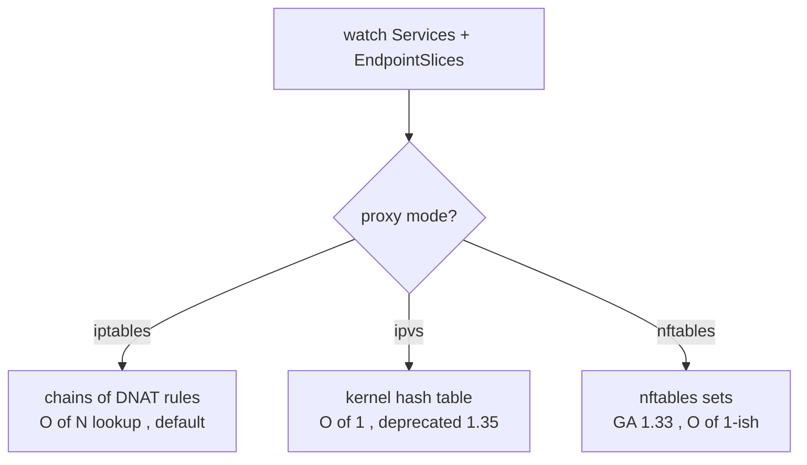

# kube-proxy — turning a Service VIP into a real Pod IP

A Service ClusterIP is a **virtual IP**: nothing owns it, you can't ping it, no interface holds it. kube-proxy is the node-level agent that watches Services and [EndpointSlices](deep:p1-endpointslices) and programs the kernel so packets *to* the VIP get **DNAT'd** to a real, Ready Pod IP. It runs on every node and only touches data-plane rules — it never proxies traffic in userspace anymore.

## The three (and a half) modes

| Mode | Data structure | Scaling | Status (2026) |
|---|---|---|---|
| **iptables** | linear netfilter chains | rule eval roughly O(N) in Service count | GA, still the **default** |
| **IPVS** | in-kernel hash + real LB algorithms (rr, lc, sh) | O(1) lookup | **deprecated as of v1.35** |
| **nftables** | nftables maps/sets | near-O(1), far fewer rules | **GA in v1.33**; not yet default |

iptables mode degrades on large clusters: thousands of Services mean huge chains and slow rule reloads. nftables mode was built to fix exactly that and is the modern replacement; IPVS solved the same problem earlier but is now on its way out.

## What actually happens to a packet

For a ClusterIP Service, kube-proxy installs a rule: "destination = VIP:port → randomly pick one Ready endpoint, DNAT to it." Load balancing is **per-connection**, decided once at connection setup — which is why long-lived gRPC/HTTP2 connections pin to a single Pod.

## Failure modes

- **Stale endpoints:** if [readiness](deep:p1-readiness-vs-liveness) flaps, kube-proxy churns rules; a Pod killed without graceful drain can still be in the rule set for a beat → connection resets.
- **`externalTrafficPolicy: Local`** preserves client source IP but only routes to Pods *on the receiving node* — a node with zero local Pods black-holes that traffic.
- **Cilium / eBPF CNIs** can replace kube-proxy entirely, programming the same DNAT in eBPF instead of iptables/nftables.

## Interview angle
"Why can't I `ping` a ClusterIP?" — because it's just a DNAT rule kube-proxy installed, not an addressable host. And know the mode trade-off: iptables is the compatible default, nftables (GA 1.33) is the scalable future, IPVS is deprecated (1.35).
