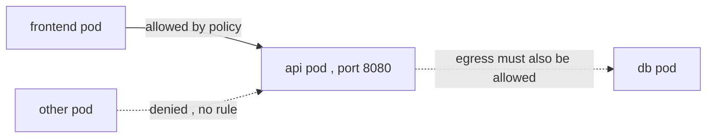

# NetworkPolicy — opt-in firewalling between Pods

The flat Pod network (§1.1) has **no isolation**: any Pod can reach any Pod and any Service VIP. A `NetworkPolicy` is an L3/L4 allow-list, selected by Pod labels, that restricts that. It is **enforced by the [CNI](deep:p1-cni), not by core Kubernetes** — apply one under Flannel and nothing happens; Calico/Cilium enforce it.

## The default-deny flip

The single most important rule: **a Pod selected by *any* policy that has an `Ingress` (or `Egress`) section becomes default-deny for that direction**, and only the listed rules are allowed. A Pod selected by *no* policy stays fully open. So you lock a namespace down with a catch-all:

```yaml
apiVersion: networking.k8s.io/v1
kind: NetworkPolicy
metadata:
  name: default-deny-ingress
  namespace: shop
spec:
  podSelector: {}        # all Pods in shop
  policyTypes: ["Ingress"]   # no ingress rules => deny all inbound
```

Then add explicit allows on top:

```yaml
  ingress:
  - from:
    - podSelector: { matchLabels: { app: frontend } }
    ports:
    - { protocol: TCP, port: 8080 }
```



## Mechanics that trip people up

- **Ingress and egress are independent.** A default-deny-egress policy will block the Pod's own DNS lookups — you must explicitly allow egress to [CoreDNS](deep:p1-coredns) on port 53, or every name resolution fails.
- **Selectors are additive, allows are unioned.** Multiple policies on a Pod combine; there is **no deny rule** and no ordering/priority in stock NetworkPolicy.
- **`namespaceSelector` vs `podSelector`** in a `from` block: listed together (one list item) they AND; as separate items they OR. A frequent source of accidentally-too-open rules.
- **Not security in depth alone:** it filters by Pod identity (labels/IP), not by authenticated identity — combine with RBAC and, for L7, a mesh or [Gateway API](deep:p1-gateway-api).

## Gotchas
Namespaces are *not* isolation boundaries by themselves (§1.4) — without a NetworkPolicy, a Pod in `dev` can hit a Pod in `prod`. And the classic outage: default-deny-egress with no DNS carve-out bricks the whole namespace.
