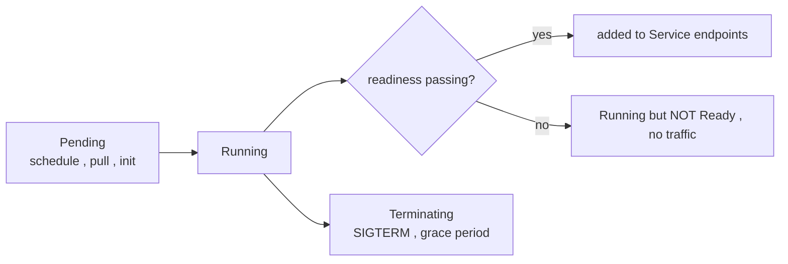

# Pod lifecycle — phases, conditions, and graceful termination

The Pod `phase` is a deliberately coarse, one-word summary. The real state lives in **conditions** and **container statuses**. Confusing the two is the root of "it says Running, why no traffic?"

## Phases vs the truth

| Phase | Meaning |
|---|---|
| `Pending` | accepted but not all containers running — scheduling, image pull, or [init containers](deep:p1-init-vs-sidecar) still going |
| `Running` | bound to a node, **≥1** container running — says **nothing** about readiness |
| `Succeeded` | all containers exited 0, won't restart |
| `Failed` | all containers terminated, ≥1 non-zero and won't restart |
| `Unknown` | node unreachable |

The decisive signals are the **conditions**: `PodScheduled`, `Initialized`, `ContainersReady`, and `Ready`. The **`Ready`** condition — driven by [readiness probes](deep:p1-readiness-vs-liveness) — is what controls [EndpointSlice](deep:p1-endpointslices) membership and thus traffic.

## Startup → graceful shutdown

On delete, the Pod enters **Terminating**: kubelet (1) removes it from endpoints, (2) runs any `preStop` hook, (3) sends **SIGTERM**, (4) waits up to `terminationGracePeriodSeconds` (default 30s), (5) sends **SIGKILL** if still alive.

The race to know: endpoint removal and SIGTERM happen *concurrently*, and removal must propagate through the endpoint controller and [kube-proxy](deep:p1-kube-proxy) on every node. So a Pod can receive in-flight requests *after* SIGTERM. Apps should keep serving briefly after SIGTERM, or use a `preStop` sleep, to drain cleanly.

## Failure modes

- **`CrashLoopBackOff`:** container exits repeatedly; kubelet backs off exponentially (10s → 20s → … → 5m cap). Usually a bad command, missing config/Secret, or a failing liveness probe restarting a healthy-but-slow app.
- **`ImagePullBackOff` / `ErrImagePull`:** bad tag, private registry without `imagePullSecrets`, or rate limits.
- **OOMKilled:** container exceeded its memory **limit** — restarted by `restartPolicy`, visible in `lastState`.
- **Stuck `Terminating`:** finalizer not cleared, or a node gone — needs investigation, not a blind force-delete.

## Interview angle
"Running but no traffic" → the Pod is Running but not **Ready**; readiness gates endpoints. "Lost requests on deploy" → endpoint removal vs SIGTERM race; add a `preStop` drain. Know that `restartPolicy: Always` is what produces CrashLoopBackOff.
