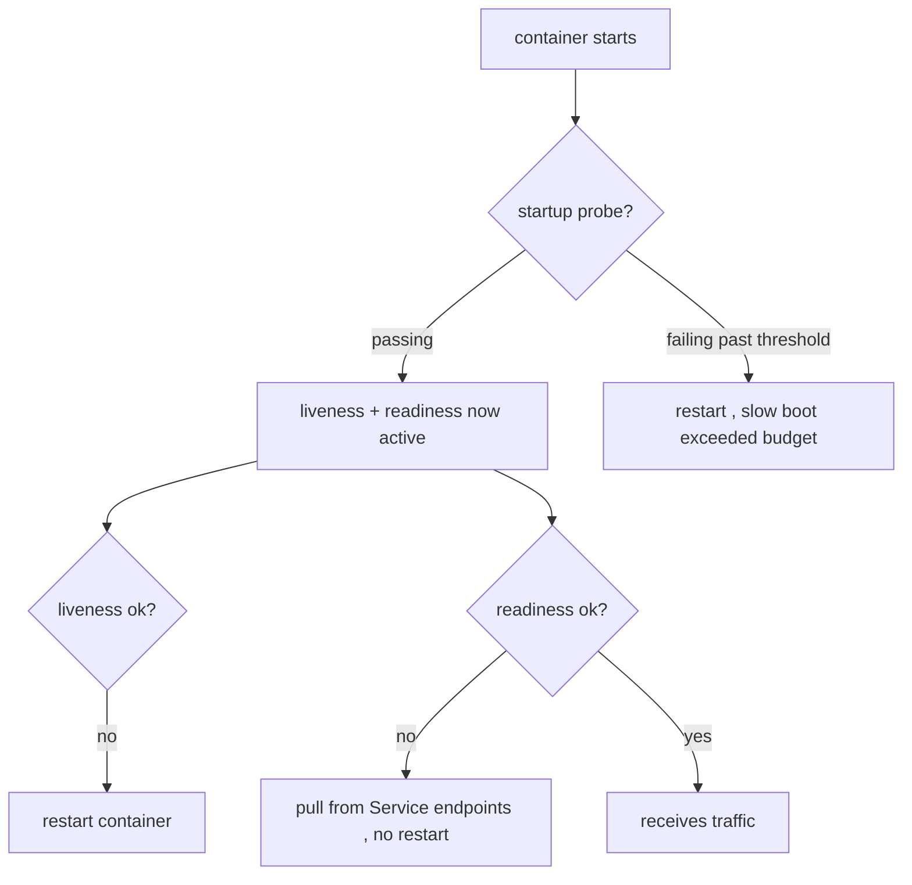

# Readiness vs liveness (vs startup) probes

Three probes, three jobs. Mixing them up causes the two most common production incidents: traffic to not-ready Pods, and restart loops on healthy-but-slow apps.

| Probe | Question it answers | Action on failure |
|---|---|---|
| **liveness** | "Is this container wedged?" | **restart** the container |
| **readiness** | "Can it serve traffic *right now*?" | **remove from [endpoints](deep:p1-endpointslices)** (no restart) |
| **startup** | "Has it finished booting?" | hold off liveness/readiness until it passes |



## The key behavioral difference

**Liveness restarts; readiness only gates traffic.** A Pod that fails readiness stays running and out of rotation until it recovers — perfect for "temporarily overloaded" or "still warming caches." A Pod that fails liveness is killed and restarted — for "deadlocked, only a restart fixes it."

## The classic mistakes

- **Liveness pointed at a dependency.** If liveness checks "can I reach the DB?", a DB blip restarts every app Pod simultaneously — turning a minor outage into a thundering-herd cascade. Liveness should test only the container *itself*; readiness can reflect dependencies.
- **No readiness probe during rollout.** The [rolling update](deep:p1-rolling-update-math) treats a Pod as available the instant it's Running, so traffic hits Pods that haven't loaded — brief 5xx every deploy.
- **Slow start tripping liveness.** A JVM that takes 90s to boot with a 30s liveness probe gets killed before it's up → CrashLoopBackOff. The fix is a **startup probe** (added exactly for this) with a generous budget, which suspends liveness until boot completes.
- **Too-aggressive `failureThreshold`/`periodSeconds`** makes probes flap under load, churning endpoints and [kube-proxy](deep:p1-kube-proxy) rules.

## Example

```yaml
startupProbe:   { httpGet: { path: /healthz, port: 8080 }, failureThreshold: 30, periodSeconds: 5 }  # up to 150s to boot
livenessProbe:  { httpGet: { path: /healthz, port: 8080 }, periodSeconds: 10 }
readinessProbe: { httpGet: { path: /ready,   port: 8080 }, periodSeconds: 5 }
```

## Interview angle
"Difference between liveness and readiness?" → restart vs remove-from-endpoints. "App restart-loops on a slow boot — fix without changing the app?" → add a startup probe. "Why not check the DB in liveness?" → a dependency blip would restart-storm all Pods; put dependency checks in readiness instead.
