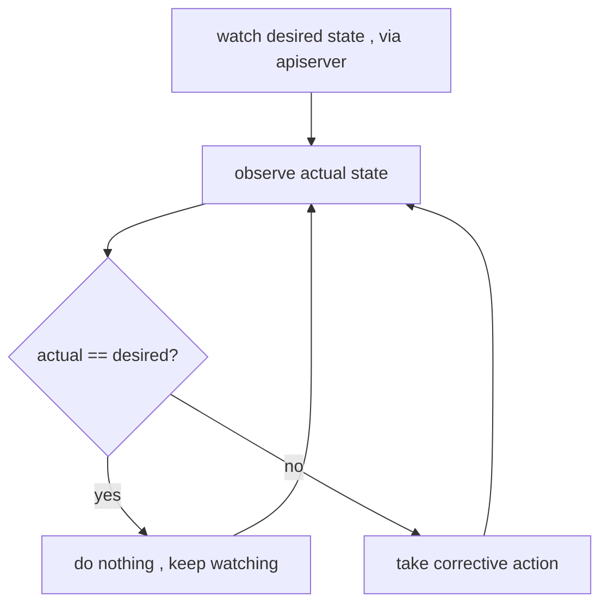

# The reconcile loop — the one idea behind all of Kubernetes

Every controller in K8s runs the same loop: **observe** current state, **diff** against desired state, **act** to close the gap, repeat. Deployments, ReplicaSets, the node controller, the endpoint controller, the [scheduler](deep:p1-scheduler) — all variations on this. Understanding it explains nearly every "why did K8s do that?" question.

## Level-triggered, not edge-triggered

This is the subtle, interview-worthy distinction. An **edge-triggered** system reacts to *events* ("a Pod was deleted") and breaks if it misses one. Kubernetes controllers are **level-triggered**: they react to the *current observed level* ("there are 2 Pods, I want 3"), so a dropped or duplicated event is harmless — the next reconcile reads reality and corrects. This is why K8s is self-healing and why controllers do periodic **resyncs** even with no events.

## How a controller watches efficiently

Controllers don't poll the apiserver in a hot loop. They use an **informer**: a local cache populated by a watch stream, plus a work queue. Events enqueue a key; a worker dequeues it, reads the *latest* object from cache, and reconciles. Failures are **re-queued with backoff** — so a transient apiserver hiccup just delays convergence, it doesn't lose work.

## Why this shapes everything

- **You declare *what*, never *how*.** `kubectl apply` writes desired state to [etcd](deep:p1-etcd); controllers converge.
- **Self-healing for free:** delete a Pod owned by a ReplicaSet and the RS recreates it — not because of a "Pod deleted" hook, but because the observed count dropped below desired.
- **Ownership chains** (Deployment → ReplicaSet → Pod) are just nested reconcile loops, each watching the layer below.
- **CRDs + custom controllers** (operators) extend the same pattern to your own resources — the Operator pattern *is* the reconcile loop applied to app-specific desired state.

## Gotchas
Because it's level-triggered, fighting the controller loses: manually scaling a Deployment-owned RS is undone on the next reconcile. And a controller that's down doesn't break running workloads — it just stops converging, so new desired state isn't acted on until it recovers.
