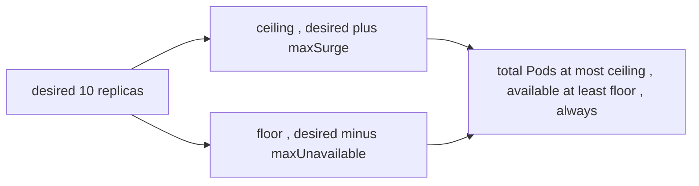

# Rolling update math — maxSurge & maxUnavailable

A `RollingUpdate` Deployment swaps old Pods for new ones a batch at a time, bounded by two knobs. Getting the math right is the difference between zero-downtime and a capacity dip mid-deploy.

## The two bounds

- **`maxUnavailable`** — how many Pods *below* the desired count you'll tolerate at once. The **floor** on available capacity.
- **`maxSurge`** — how many Pods *above* the desired count you'll temporarily allow. The **ceiling** on total Pods.

Both accept an absolute number or a percentage. Defaults: **25% each**. Rounding rule: **`maxSurge` rounds up, `maxUnavailable` rounds down** — both biased toward keeping more capacity.

## Worked example — `replicas: 10`, defaults (25% / 25%)

- ceiling = 10 + ceil(2.5) = **13** total Pods allowed
- floor = 10 − floor(2.5) = **8** Pods must stay available

So the controller surges the new ReplicaSet up toward 13 and scales the old down, but never lets *available* (Ready, per [readiness](deep:p1-readiness-vs-liveness)) drop below 8 — and only counts a new Pod once its **readiness probe** passes ([endpoints](deep:p1-endpointslices)).

## Tuning recipes

| Goal | Setting | Trade-off |
|---|---|---|
| Never lose capacity | `maxUnavailable: 0`, `maxSurge: 25%+` | needs spare cluster headroom to surge |
| Fastest rollout | high `maxSurge`, high `maxUnavailable` | brief capacity dip, more in-flight churn |
| Tight resource budget | `maxSurge: 0`, `maxUnavailable: 1` | slower, runs at reduced capacity during deploy |
| **Illegal** | `maxSurge: 0` **and** `maxUnavailable: 0` | rejected — rollout can't make progress |

## Failure modes

- **No readiness probe:** every new Pod counts as "available" the instant it's Running, so the controller blows through the whole rollout before anything can serve — silent 5xx. The probe is what makes the math meaningful.
- **`maxSurge` with no headroom:** if the cluster can't [schedule](deep:p1-scheduler) the surge Pods, they sit `Pending` and the rollout stalls.
- **Slow readiness:** rollout legitimately pauses (`progressDeadlineSeconds` eventually marks it failed) — that's the gate doing its job, not a hang.

## Interview angle
"How does a rolling update stay zero-downtime?" → new RS surges up within `maxSurge` while old scales down within `maxUnavailable`, and the **readiness probe** gates each step. "What silently breaks it?" → a missing/too-lenient readiness probe. Be ready to compute the ceiling/floor for given replicas and percentages, and know `0/0` is illegal.
