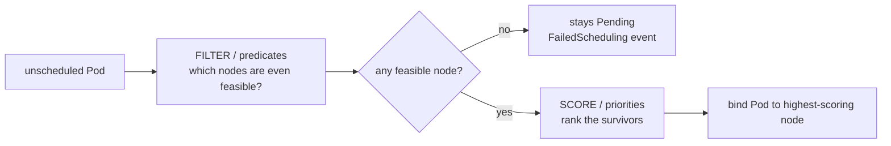

# kube-scheduler — how a Pod gets a node

A freshly created Pod has `spec.nodeName` empty — it's **unscheduled**. The scheduler watches for such Pods and, for each, runs a two-phase pipeline, then writes the chosen node back via a **binding**. It only *decides*; the kubelet on that node does the actual starting.

## Filter, then score

**Filtering** eliminates nodes that *can't* run the Pod: insufficient CPU/memory **requests**, unsatisfied `nodeSelector`/affinity, a **taint** the Pod doesn't **tolerate**, port conflicts, volume zone mismatch. **Scoring** ranks the rest: spread across nodes/zones, image already present, affinity preferences, least-loaded.

## The levers you control

| Mechanism | Effect |
|---|---|
| **requests** | the *only* thing the scheduler uses for capacity math (not limits, not real usage) |
| **nodeSelector / nodeAffinity** | hard or soft node constraints |
| **podAffinity / antiAffinity** | co-locate or spread relative to other Pods |
| **taints + tolerations** | nodes repel Pods unless the Pod tolerates the taint |
| **topologySpreadConstraints** | even spread across zones/nodes |
| **priorityClass** | high-priority Pods can **preempt** (evict) lower ones |

## Edge cases / failure modes

- **Scheduler uses `requests`, not actual usage.** A Pod requesting `0` CPU schedules anywhere and can starve neighbors; one requesting more than any node has stays `Pending` forever.
- **`Pending` + `FailedScheduling`** almost always means: not enough requestable resources, or a taint/affinity no node satisfies. `kubectl describe pod` shows the reason per node.
- **Preemption** evicts lower-priority Pods to fit a higher-priority one — surprising if you didn't set priority classes deliberately.
- **DaemonSet Pods** historically bypassed the scheduler; now they go through it but with the node pre-selected.
- Scheduling is a [reconcile loop](deep:p1-reconcile-loop) like everything else — kill the scheduler and existing Pods keep running, but new Pods pile up unscheduled.

## Interview angle
"Pod stuck Pending — why?" → run `describe`; it's resource requests vs node capacity, or an unsatisfied taint/affinity. Stress that the scheduler reasons over **requests**, not live utilization, which is why right-sizing requests matters.
