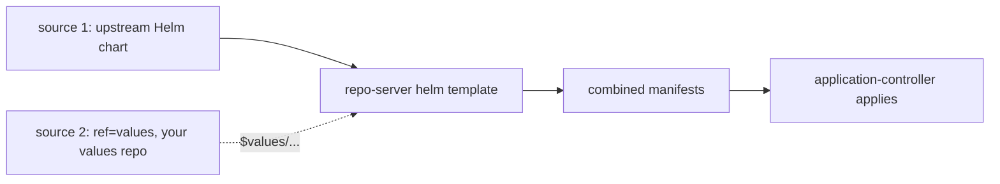

# ArgoCD Multi-Source Applications

A single ArgoCD Application can pull from **multiple sources** (`spec.sources`, plural) and combine them into one rendered set of manifests. The canonical use: an **upstream Helm chart** from one repo plus **your values** from a different (private) repo.

## The `$values` ref pattern

```yaml
spec:
  sources:
    - repoURL: https://charts.example.com
      chart: my-app
      targetRevision: 4.2.0
      helm:
        valueFiles:
          - $values/envs/prod/values.yaml   # pulled from the ref below
    - repoURL: https://github.com/org/config.git
      targetRevision: main
      ref: values                          # this source is value-only
```

The second source is marked `ref: values` and contributes **no manifests** — it only provides files that the first source's Helm render references via `$values/...`. This lets you track an upstream chart version while keeping environment values in your own GitOps repo.



## Rules & gotchas

- **Last source wins** on duplicate resources: if two sources produce the same Kind/Name/Namespace, the later source in the list overrides — and ArgoCD emits a `RepeatedResourceWarning`. Easy to silently clobber a resource.
- **Health is per-Application, not per-source.** The whole app gets one health/sync status; you can't see "source 1 healthy, source 2 degraded" separately.
- **Not for grouping unrelated apps.** Multi-source combines *into one* logical app. To manage many independent apps use **app-of-apps** (a root Application creating child Applications) or **ApplicationSet** (templated generation from list/git/cluster generators). Reaching for multi-source to "bundle apps" is a classic misuse.
- A `ref`-only source must not also try to render manifests; mixing intents causes confusing diffs.
- Like all ArgoCD Helm usage, it runs `helm template` (not `helm install`) — **no Helm release object exists**, so `helm list` is empty (§2.6, §3).

## When to use which

| Need | Tool |
|---|---|
| upstream chart + own values | multi-source (`$values` ref) |
| one root managing many child apps | app-of-apps |
| N similar apps across envs/clusters | ApplicationSet |

**Interview angle:** "Combine an upstream chart with your own values in ArgoCD?" → multi-source Application with a `ref: values` source referenced as `$values/...`, mindful of last-source-wins and app-level (not per-source) health. And it's distinct from app-of-apps / ApplicationSet, which solve *grouping*, not *combining*.
