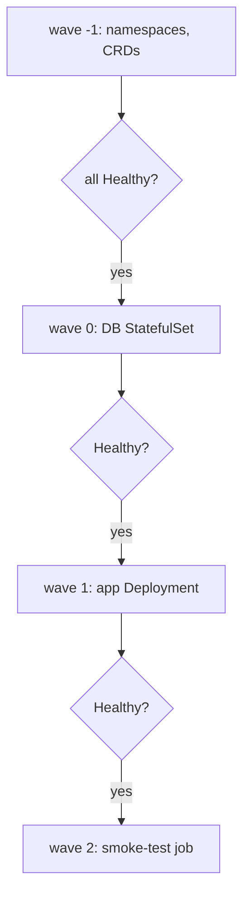

# ArgoCD Sync Waves, Hooks & Health

By default ArgoCD applies all of an Application's manifests together (respecting only built-in kind ordering: namespaces/CRDs first). To enforce *your* ordering — "migrate the DB, then deploy the app, then smoke-test" — you use **sync waves** and **resource hooks**, gated by **health**.

## Sync waves

Annotate resources with an integer wave; ArgoCD applies the lowest wave first and **waits for every resource in a wave to become Healthy** before starting the next.

```yaml
metadata:
  annotations:
    argocd.argoproj.io/sync-wave: "1"   # default 0; negatives run earliest
```



## Hooks

Hooks are resources (usually Jobs) annotated to run at a phase rather than as steady-state objects:

| Phase | When |
|---|---|
| `PreSync` | before the main sync — DB migrations, schema changes |
| `Sync` | during sync (alongside normal resources) |
| `PostSync` | after all resources are Healthy — smoke tests, cache warm |
| `SyncFail` | only if the sync failed — rollback/cleanup |

```yaml
metadata:
  annotations:
    argocd.argoproj.io/hook: PreSync
    argocd.argoproj.io/hook-delete-policy: HookSucceeded
```

`hook-delete-policy`: `HookSucceeded` (clean up on success), `BeforeHookCreation` (delete prior run first — avoids "job is immutable" errors on re-sync), or `HookFailed`.

## Health

ArgoCD computes a **health status** per resource:
- Deployments/StatefulSets → built-in checks (`availableReplicas`, rollout progress).
- Services, PVCs, Ingress → built-in.
- Custom resources → **Lua health scripts** (built-in for many operators; you can add your own). This is how ArgoCD knows a `Kafka` CR or `Certificate` is actually ready, not just applied.

Waves only advance on Healthy; hooks block the phase until the hook resource reports complete.

## Gotchas

- **A hook Job that never completes stalls the entire sync** — set `activeDeadlineSeconds` and `backoffLimit` so a failed migration fails fast instead of hanging forever.
- Forgetting `BeforeHookCreation` on a PreSync migration Job → second sync fails because the Job already exists and Jobs are immutable.
- A CR with **no health check** is treated as Healthy immediately, so a later wave may start before the underlying thing is truly ready — add a Lua health check.
- Sync waves order *apply*, not *delete* in the same way; deletion ordering uses reverse waves with pruning.

**Interview angle:** "How do you guarantee DB migration runs before the app deploys in GitOps?" → PreSync hook (or earlier sync-wave), and ArgoCD only advances waves once resources report Healthy. Plain manifests have no such ordering.
