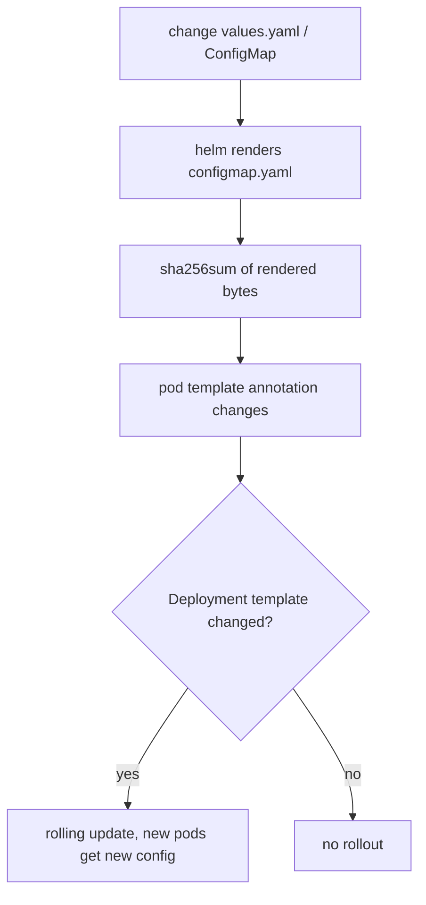

# The checksum/config Annotation Pattern

The problem: env-injected ConfigMaps/Secrets are [frozen at Pod start](deep:p2-configmap-reload), and editing a ConfigMap does **not** change the Deployment's Pod template, so the Deployment controller sees no diff and never rolls. You need a way to make a config change *look like* a template change.

## The pattern

Embed a hash of the config into a Pod-template **annotation**. When the config changes, the hash changes, the Pod template changes, and the Deployment performs a normal rolling update (§1.6).

```yaml
spec:
  template:
    metadata:
      annotations:
        checksum/config: {{ include (print $.Template.BasePath "/configmap.yaml") . | sha256sum }}
        checksum/secret: {{ include (print $.Template.BasePath "/secret.yaml") . | sha256sum }}
```

That is Helm's canonical form: it renders the ConfigMap template, SHA-256s the rendered bytes, and stamps the result on the Pod template.



## Why an annotation and not a label

Labels are used by selectors; changing a Pod-template **label** can break the ReplicaSet selector relationship. Annotations are free-form metadata that still count as a template change for the rollout hash, so they are the safe carrier.

## Edge cases

- **Hash the rendered output, not `values.yaml`.** Two different value sets can render to identical manifests (or the reverse), so hashing the final ConfigMap is the correct invariant.
- **Mounted-as-volume config** updates live without this — but if your app can't reload, you still want the rollout, so the annotation is still useful.
- In **ArgoCD/raw kustomize**, the equivalent is a **ConfigMap generator** with a content hash suffix (`my-config-7d8f...`); the name change forces a new Pod template and prunes the old ConfigMap. Same idea, different mechanism.
- Without this, a Secret rotation via env leaves old pods running stale credentials until the next unrelated deploy — a silent security gap.

**Interview angle:** "How do you make pods pick up a changed ConfigMap when it's consumed via env?" Answer: a `checksum/config` annotation on the Pod template (or a hashed-name ConfigMap generator) so the Deployment rolls — and explain *why* it must be the template, not the live object.
