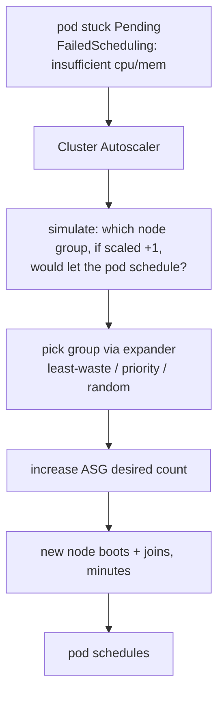

# Cluster Autoscaler

The Cluster Autoscaler (CA) is the original, cloud-portable node autoscaler. It scales **predefined node groups** (AWS ASGs, GKE node pools, AKS VMSS) up when pods can't schedule and down when nodes are underused.

## Scale-up loop

CA only reacts to **Pending** pods that fail scheduling due to resources — it does not pre-warm. The **expander** strategy chooses among eligible groups (`least-waste` packs tightest; `priority` follows your ordering; `price` on some clouds).

## Scale-down

A node is a removal candidate if it's been **underutilized** (default <50%) for `--scale-down-unneeded-time` (default 10 min) **and** all its pods can move elsewhere. Blockers:
- pods without a controller (bare pods),
- pods with restrictive [PodDisruptionBudgets](deep:p2-poddisruptionbudget),
- local storage / `emptyDir`,
- the `cluster-autoscaler.kubernetes.io/safe-to-evict: "false"` annotation.

## Key constraints

- **Fixed instance types per group**: a group is one shape. To offer many sizes you run many node groups; CA won't invent an instance type. This is the main contrast with [Karpenter](deep:p2-karpenter).
- **Node groups must be homogeneous** — CA assumes all nodes in a group are identical when simulating.
- **Slow**: minutes per scale event (ASG/VMSS provisioning + kubelet join), which widens the [thundering-herd](deep:p2-hpa-algorithm) gap when HPA scales pods faster than nodes appear.
- Won't scale a group below its configured **min** or above **max**.

## When to choose CA over Karpenter

- **Multi-cloud / GKE / AKS** where Karpenter support is thinner.
- Steady, predictable workloads where bin-packing/consolidation gains are small.
- Teams that want node shapes tightly controlled via a few well-defined groups.

**Gotcha / interview angle:** CA reacts only to unschedulable pods and scales whole node groups, so over-provisioned requests directly waste money and a single restrictive PDB or `emptyDir` pod can pin an otherwise-idle node up. Karpenter exists largely to fix CA's "fixed groups + slow + fragmented packing" limitations.
