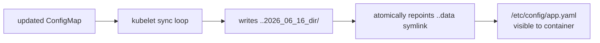

# ConfigMap & Secret Reload Mechanics

Whether a config change reaches a running Pod depends entirely on the **injection method** — there are three behaviours, and conflating them is the single most common "my change did nothing" bug.

| Injection | Live update? | Why |
|---|---|---|
| `env` / `envFrom` | **No** | env vars are materialised into the process at `exec` time; the kernel has no way to mutate another process's environment |
| volume mount | **Yes**, ~1 min | the kubelet rewrites the file on its sync loop |
| volume mount with `subPath` | **No** | `subPath` copies the single file once at mount; it is not part of the projected volume that gets refreshed |

## How volume refresh actually works

The kubelet runs a periodic sync (`--sync-frequency`, default 1 min) plus a watch/TTL cache (`configMapAndSecretChangeDetectionStrategy`, default `Watch`). On change it materialises the new content into a **timestamped directory** and atomically swaps a symlink:



Because the swap is a single `rename()` on the `..data` symlink, the application never reads a half-written file. But the kubelet only writes the file — **your process must re-read it**. Apps that read config once at boot will not notice. Options: a file watcher (inotify) in the app, a sidecar that signals reload (e.g. `SIGHUP` to nginx), or a tool like Reloader/Stakater that watches the ConfigMap and triggers a rollout.

## Forcing a rollout instead

If the app can't hot-reload (or you used `env`), the idiomatic fix is the [checksum annotation](deep:p2-checksum-annotation): hash the ConfigMap into a Pod-template annotation so any change rolls the Deployment (§1.6).

## immutable & optional

```yaml
apiVersion: v1
kind: ConfigMap
metadata: { name: app-config }
immutable: true   # kubelet stops watching it -> less API/etcd load
data: { app.yaml: "..." }
```

`immutable: true` removes the watch entirely (good for large, stable config across thousands of pods) but you must **recreate** to change. `optional: false` (the default for a keyed reference) blocks Pod start if the key/object is missing — handy to fail fast rather than boot with empty config.

**Gotcha / interview angle:** if asked "I edited the ConfigMap, why no change?" the complete answer covers all three cases (env frozen, volume live but app must reload, subPath frozen) plus the checksum-rollout fix — not just "add a watcher".
