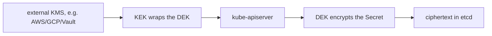

# Encryption at Rest & KMS

By default, Kubernetes Secrets are stored in **etcd as plaintext** (only base64-encoded). Anyone with etcd file/backup access — or read access to the etcd data dir — can read every Secret. Encryption at rest fixes the *storage* layer; it does not change the fact that an RBAC-authorised reader still sees decoded values via the API.

## How it works

The API server gets an `EncryptionConfiguration` that maps **resources** (e.g. `secrets`, optionally `configmaps`) to an ordered list of **providers**. On write the API server encrypts with the *first* provider; on read it tries providers in order until one decrypts — which is what makes key rotation possible.

```yaml
apiVersion: apiserver.config.k8s.io/v1
kind: EncryptionConfiguration
resources:
  - resources: ["secrets"]
    providers:
      - kms:                 # envelope encryption via external KMS
          apiVersion: v2
          name: aws-kms
          endpoint: unix:///var/run/kmsplugin/socket.sock
      - aesgcm: { keys: [...] }   # fallback / migration
      - identity: {}              # plaintext - keep LAST so old data still reads
```



## Provider choices

| Provider | Key location | Notes |
|---|---|---|
| `identity` | none | no encryption (the implicit default); useful only as last entry during migration |
| `aescbc` / `aesgcm` | **in the config file on the master** | better than nothing, but the key sits next to etcd — a thief with disk access gets both |
| `secretbox` | in the file | similar trade-off |
| `kms` v2 | external KMS (HSM-backed) | **envelope encryption**: KMS holds the Key-Encryption-Key, each Secret uses a Data-Encryption-Key. The recommended production option |

**KMS v2** (stable on modern clusters) caches DEKs and uses a key hierarchy so the API server doesn't call KMS on every read — fixing v1's performance and rotation pain.

## Rotating keys

Add the new key as the **first** provider, restart API servers, then rewrite all secrets so they re-encrypt with it:

```bash
kubectl get secrets -A -o json | kubectl replace -f -
```

Only then can you drop the old key.

## What it does NOT protect

- A user with `get secrets` RBAC — they read the decoded value through the API regardless. Encryption at rest is about stolen disks/backups, not authorisation.
- This is why [Sealed Secrets](deep:p2-sealed-secrets) and [External Secrets](deep:p2-external-secrets) exist: keep the plaintext *out of the cluster/Git* entirely.

**Gotcha:** `aescbc` with a local key is theatre against an attacker who already has the etcd disk (key is right there). Use KMS v2 for real protection, and never remove the `identity`/old provider before rewriting all secrets — you'll make existing data unreadable.
