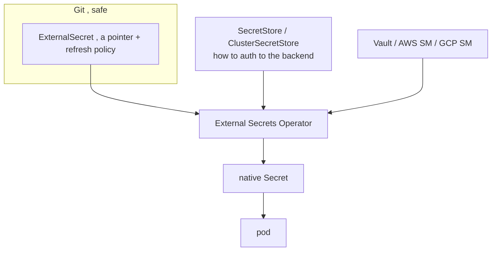

# External Secrets Operator (ESO)

ESO keeps the **real secret value out of the cluster and out of Git entirely** — only a *pointer* lives in your manifests. A controller syncs the value from an external store (HashiCorp Vault, AWS/GCP/Azure secret managers, 1Password, etc.) into a native Kubernetes `Secret`.

## Objects



- **SecretStore** (namespaced) / **ClusterSecretStore** (cluster-wide): connection + auth to a backend (e.g. IRSA/Workload Identity, Vault Kubernetes auth).
- **ExternalSecret**: which remote keys to pull, the target Secret name, a `refreshInterval`, and an optional `template` to reshape data.

```yaml
apiVersion: external-secrets.io/v1
kind: ExternalSecret
metadata: { name: db-creds }
spec:
  refreshInterval: 1h
  secretStoreRef: { name: vault-backend, kind: ClusterSecretStore }
  target: { name: db-creds }     # the K8s Secret ESO will create
  data:
    - secretKey: password
      remoteRef: { key: secret/data/prod/db, property: password }
```

## Why it beats raw / sealed secrets at scale

- **Rotation with no Git change**: rotate in Vault; ESO re-syncs on `refreshInterval`. With [Sealed Secrets](deep:p2-sealed-secrets) you'd re-seal and commit.
- **One source of truth** across many clusters — six clusters all point at the same Vault path.
- **Auth is workload-identity based** (IRSA / GCP Workload Identity / Vault k8s auth), so no long-lived backend credentials sit in the cluster.

## Failure modes

- If the backend is unreachable, ESO keeps the **last good** Secret but the `ExternalSecret` goes `SecretSyncedError`. Pods already running are fine; new pods get the stale value until sync recovers.
- `refreshInterval` is pull-based, not event-driven — a rotation isn't instant. Push-based reactions need a separate trigger (or a shorter interval, at the cost of API calls).
- Updating the Secret does **not** restart pods consuming it via env — same [reload caveat](deep:p2-configmap-reload); pair with a reloader or rollout for env consumers.

**Interview angle:** ESO = "pointer in Git, value in Vault, controller syncs." Contrast with Sealed Secrets ("ciphertext in Git, decrypt in cluster"). ESO is the CNCF-graduated, fleet-scale answer; Sealed Secrets is the simpler single-cluster answer. ESO is the de-facto successor to the older `kubernetes-external-secrets`.
