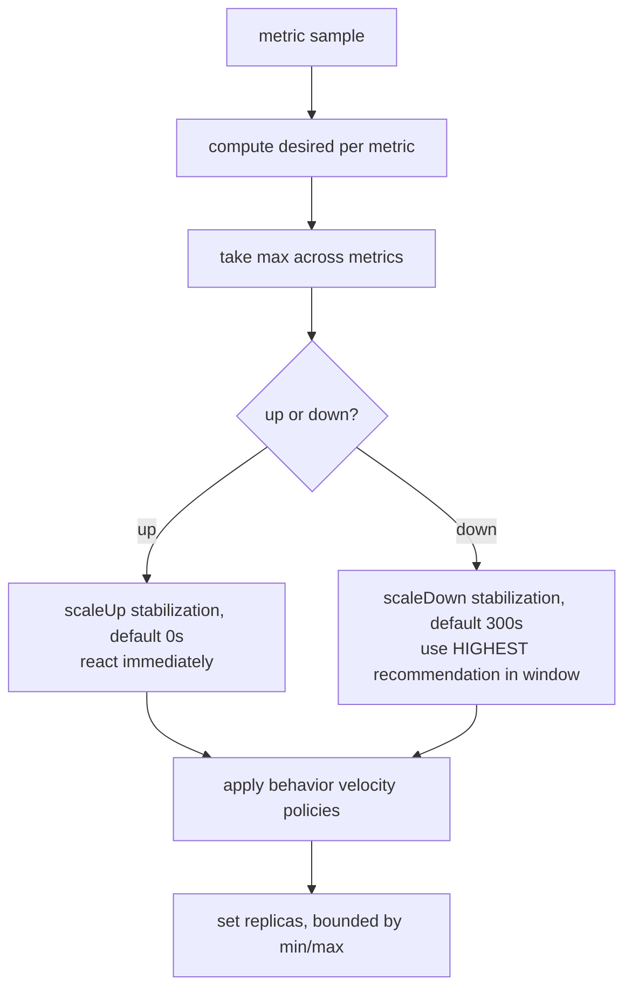

# HPA v2 Scaling Algorithm

The Horizontal Pod Autoscaler (`autoscaling/v2`) recomputes desired replicas on a loop (default ~15s, `--horizontal-pod-autoscaler-sync-period`) using one core formula:

```
desiredReplicas = ceil( currentReplicas × ( currentMetricValue / targetMetricValue ) )
```

Example: 4 replicas, target CPU 50%, current average 100% → `ceil(4 × 100/50) = 8`. Double the load, double the pods.

## Tolerance — why small changes do nothing

A ratio inside `1 ± tolerance` (default **0.1**, i.e. 90–110%) is treated as "no change." This dead-band prevents flapping around the target. So at target 50%, CPU of 52% won't add a pod; 60% will.

## Multiple metrics → take the max

With several metrics (CPU + memory + a custom RPS metric), HPA computes `desiredReplicas` for each **independently** and uses the **largest**. It scales up if *any* metric demands it; it only scales down when *all* allow it.

## Stabilization & behavior policies



- **Scale-down stabilization** (`behavior.scaleDown.stabilizationWindowSeconds`, default 300s): over the trailing window, HPA picks the *highest* desired value — so it won't shrink on a brief dip.
- **Scale-up stabilization**: default **0s** — it reacts fast to spikes.
- **behavior policies** cap velocity: e.g. "no more than 100% or 4 pods added per 60s," "remove at most 10% per minute." `selectPolicy: Max/Min/Disabled` chooses among policies (or disables a direction).

```yaml
behavior:
  scaleDown:
    stabilizationWindowSeconds: 300
    policies: [{ type: Percent, value: 10, periodSeconds: 60 }]
  scaleUp:
    policies: [{ type: Pods, value: 4, periodSeconds: 60 }]
```

## Requirements & limits

- Needs **metrics-server** for CPU/memory; custom metrics need a metrics adapter (Prometheus Adapter), external metrics need an external adapter.
- CPU/memory percentage targets are meaningless without **requests** set (the % is of the request).
- HPA **cannot scale to zero** — for event-driven scale-to-zero use [KEDA](deep:p2-keda), which acts as an HPA metrics source.
- Don't run HPA and [VPA](deep:p2-vpa-inplace) on the same resource metric — they oscillate.

**Interview angle:** recite the formula, the ±10% tolerance, max-across-metrics, and the asymmetric stabilization (fast up, slow down). The "why does it flap / why won't it scale down" answers all live in those defaults.
