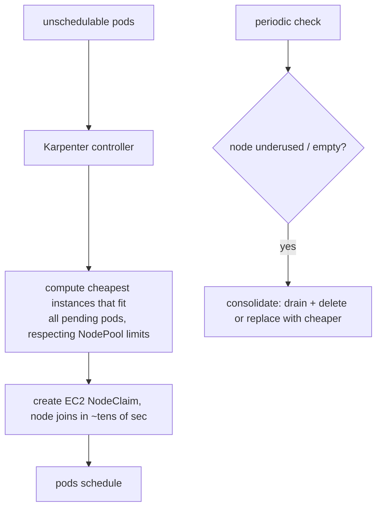

# Karpenter — Just-in-Time Node Provisioning

Karpenter is a node autoscaler that provisions **right-sized nodes directly from the cloud API** in response to unschedulable pods, instead of scaling fixed node groups. It reached **v1.0 GA in 2024** and is on the v1.x line (APIs `karpenter.sh/v1`). Originally AWS, now with a vendor-neutral core.

## Core loop



## Two CRDs

- **NodePool**: constraints for what Karpenter may launch — instance families, architectures, zones, capacity type (spot/on-demand), limits, and **disruption** policy (consolidation, expiry, `consolidateAfter`).
- **EC2NodeClass** (AWS): the provider-level template — AMI family, subnets, security groups, IAM role, block devices.

```yaml
apiVersion: karpenter.sh/v1
kind: NodePool
spec:
  template:
    spec:
      requirements:
        - { key: karpenter.sh/capacity-type, operator: In, values: ["spot","on-demand"] }
        - { key: kubernetes.io/arch, operator: In, values: ["arm64","amd64"] }
  disruption:
    consolidationPolicy: WhenEmptyOrUnderutilized
    consolidateAfter: 1m
```

## Why it beats [Cluster Autoscaler](deep:p2-cluster-autoscaler)

- **No node groups**: CA scales pre-defined ASGs of fixed instance types; Karpenter picks the *cheapest instance that fits* the actual pending pods, mixing types/sizes freely.
- **Speed**: launches nodes in tens of seconds vs CA's ASG warm-up minutes — narrows the [thundering-herd](deep:p2-hpa-algorithm) gap when HPA outruns node supply.
- **Consolidation**: actively bin-packs — drains underused nodes and replaces a few large nodes with a cheaper mix, lowering cost continuously.
- **Spot-native**: handles interruption + diversification well.

## Gotchas

- **Consolidation causes voluntary disruption** — pods get drained/rescheduled. Protect critical workloads with a [PodDisruptionBudget](deep:p2-poddisruptionbudget) and `karpenter.sh/do-not-disrupt` annotations, or pods will be moved at inconvenient times.
- Spot reclaim means designing for interruption (graceful shutdown, replicas across capacity types).
- It provisions for *pending* pods — if a [VPA in-place resize](deep:p2-vpa-inplace) is `Infeasible` on existing nodes that isn't a pending pod, so it won't directly trigger Karpenter.
- Mostly AWS-mature; other clouds vary in support.

**Interview angle:** "CA vs Karpenter?" → CA bumps fixed node groups (multi-cloud, simple); Karpenter provisions right-sized nodes directly + consolidates for cost (AWS-native, fast, spot-friendly). The headline win is groupless, just-in-time, cost-optimising provisioning.
