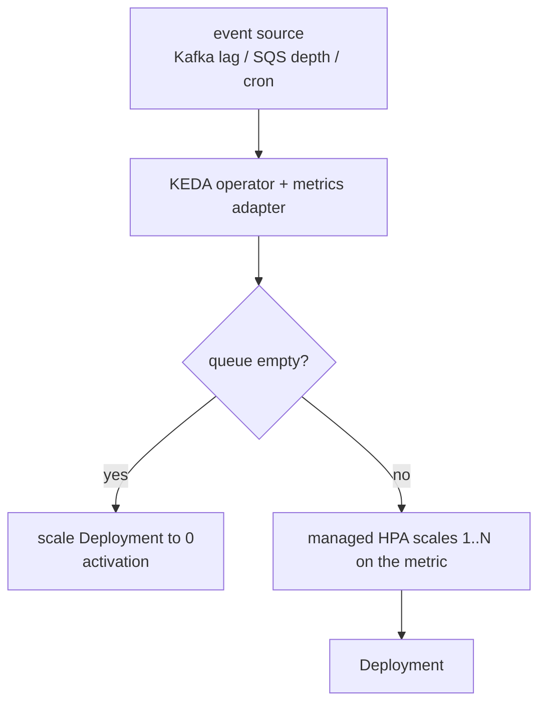

# KEDA — Event-Driven Autoscaling

[HPA](deep:p2-hpa-algorithm) scales on CPU/memory or metrics it can already read. **KEDA** (Kubernetes Event-Driven Autoscaler, a CNCF graduated project, 2.x line) extends it to **event sources** — Kafka consumer lag, RabbitMQ/SQS queue depth, Prometheus queries, cron schedules, Redis lists, and dozens more **scalers** — and crucially can **scale to (and from) zero**.

## How it relates to HPA

KEDA doesn't replace HPA — it **drives** it. You write a `ScaledObject`; KEDA creates and manages an HPA under the hood, feeding it an external metric from your event source.



```yaml
apiVersion: keda.sh/v1alpha1
kind: ScaledObject
metadata: { name: consumer }
spec:
  scaleTargetRef: { name: consumer }
  minReplicaCount: 0          # scale to zero when idle
  maxReplicaCount: 20
  cooldownPeriod: 300
  triggers:
    - type: kafka
      metadata: { topic: orders, lagThreshold: "100" }
```

## The two phases

- **Activation** (0 → 1): KEDA's operator watches the source directly and "activates" the workload when work appears, scaling from zero. HPA cannot do this (it has no concept of 0 replicas).
- **Scaling** (1 → N): once active, the managed HPA takes over using the [standard formula](deep:p2-hpa-algorithm) against the event metric (e.g. lag per replica).

## ScaledJob vs ScaledObject

- `ScaledObject` scales a long-running Deployment/StatefulSet.
- `ScaledJob` spawns a **Job per batch of events** — better for work that should run to completion rather than as a daemon.

## Gotchas

- **Cold-start latency**: scaling from zero means the first event waits for a pod to start (and image pull). For latency-sensitive paths, keep `minReplicaCount: 1`.
- **`cooldownPeriod`** governs how long after the last event before scaling back to zero — too short causes thrash on bursty queues.
- Authentication to sources uses `TriggerAuthentication` objects (often pulling from a Secret / [ESO](deep:p2-external-secrets)).
- KEDA still relies on node capacity — if scale-up outpaces nodes, you need [Karpenter](deep:p2-karpenter)/[Cluster Autoscaler](deep:p2-cluster-autoscaler) behind it.

**Interview angle:** "HPA can't scale to zero — what do you use?" → KEDA, which manages an HPA and adds the 0↔1 activation phase plus event-source scalers. It's the standard answer for queue/stream workers and scale-to-zero microservices.
