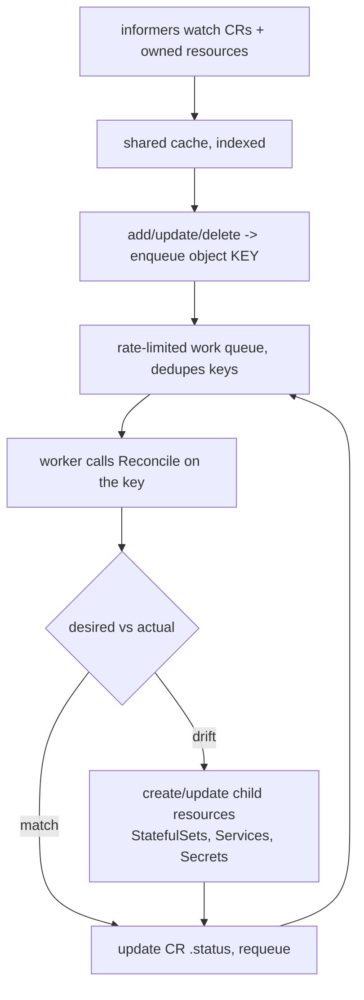

# Operator Pattern Internals

An Operator is the §1.2 control loop applied to a custom domain. A **CRD** registers a new `kind`; a **CR** is an instance with a desired `spec`; the **Operator** is a controller that reconciles real-world state to match that spec — encoding the operational knowledge a human SRE would otherwise apply (failover, backup, rebalance, version upgrades).

## The controller-runtime loop

Key properties that make it correct:

- **Level-triggered, not edge-triggered**: `Reconcile` receives only an object *key*, then reads current state and acts on the gap. It must **not** depend on which event fired — a missed event just means the next reconcile fixes it. This is what makes operators self-healing.
- **Idempotent**: running `Reconcile` twice with no change must be a no-op. Use server-side apply / create-or-update, not blind creates.
- **Informers + work queue**: a shared informer maintains a local cache (no hammering the API server); changes enqueue keys; a rate-limited queue dedupes and backs off on errors.
- **ownerReferences**: child resources point back to the CR. Kubernetes garbage collection then **cascade-deletes** children when the CR is deleted, and the informer watching owned types re-triggers reconcile when a child drifts.
- **status subresource**: the operator reports observed state on `.status` (conditions, phase). Updating status is a separate write that doesn't bump `.metadata.generation`, so it doesn't cause a reconcile storm.

## Maturity model (levels 1–5)

1. Basic install, 2. seamless upgrades, 3. full lifecycle (backups, failover), 4. deep insights (metrics/alerts), 5. auto-pilot (auto-tuning, anomaly response). Interviewers like this framing for "what makes an operator more than a Helm chart."

## Operator vs Helm chart

A chart renders **static YAML once** at install/upgrade. An operator runs **continuously**, reacting to failures and cluster events. Use a chart for stateless apps; an operator for stateful systems with Day-2 logic — e.g. **Strimzi** (Kafka), **CloudNativePG** (Postgres), **cert-manager**, **Prometheus Operator**. (Operators are often *installed* by a Helm chart — the chart bootstraps the controller + CRDs.)

## Gotchas

- **Deleting a CRD deletes every CR of that kind** — and cascade-deletes their children. For stateful operators that can mean dropping databases. Guard CRDs.
- **CRD version upgrades** need a conversion webhook to migrate stored objects between versions; a botched conversion can wedge the API for that resource.
- A reconcile that isn't idempotent (e.g. always appends) corrupts state on every loop.

**Interview angle:** "Why an operator over a chart?" → continuous, level-triggered reconciliation of domain state with ownerReference-based GC and status reporting — automating Day-2 ops a static chart can't.
