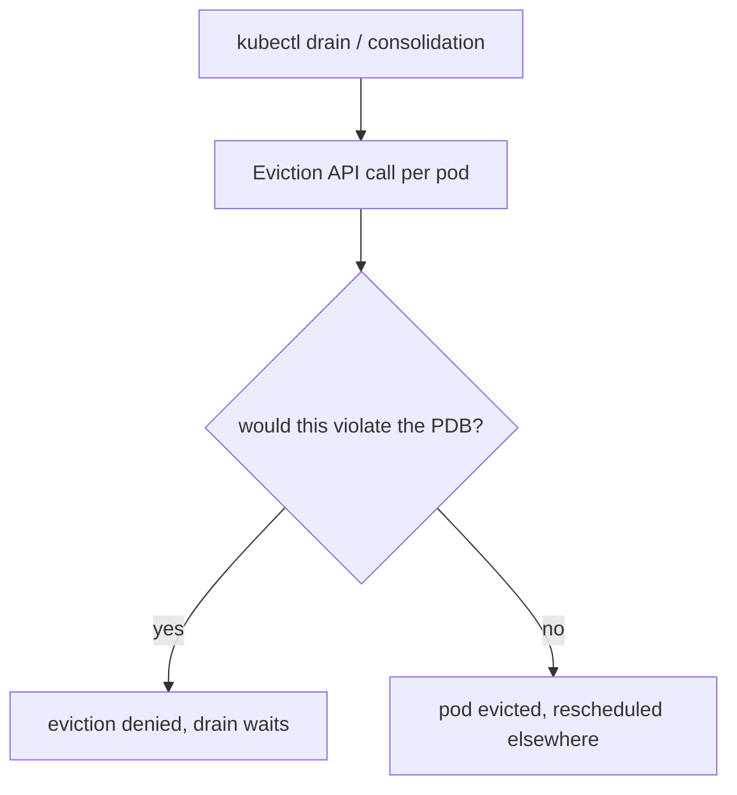

# PodDisruptionBudget (PDB)

A PDB limits how many pods of an application can be down due to **voluntary disruptions** — and only voluntary ones. It's how you keep a quorum alive during node drains, cluster upgrades, and autoscaler consolidation.

## Voluntary vs involuntary (the key distinction)

| Voluntary (PDB protects) | Involuntary (PDB does NOT protect) |
|---|---|
| `kubectl drain` / node cordon | node hardware failure |
| cluster/node upgrades | kernel panic, VM crash |
| [Karpenter](deep:p2-karpenter)/CA consolidation | [OOM kill / node-pressure eviction](deep:p2-qos-eviction) |
| manual pod eviction via Eviction API | preemption by higher [priority](deep:p2-qos-eviction) (mostly) |

A PDB cannot save you from a node catching fire — for that you need replicas spread across nodes/zones (anti-affinity, topology spread). PDB only gates the **Eviction API**, which drains and consolidation tools use.



## Spec

Set exactly one of `minAvailable` / `maxUnavailable` (absolute or percentage):

```yaml
apiVersion: policy/v1
kind: PodDisruptionBudget
spec:
  minAvailable: 2          # or maxUnavailable: 1 / "25%"
  selector:
    matchLabels: { app: payments }
```

`minAvailable: 2` on a 3-replica app means at most 1 can be voluntarily evicted at a time — a drain evicts one, waits for the replacement to become Ready, then proceeds.

## Gotchas

- **A too-strict PDB blocks node drains/upgrades entirely.** `minAvailable: 100%` (or `maxUnavailable: 0`) means **no** pod can ever be voluntarily evicted — `kubectl drain` hangs forever and the node never gets patched. Classic cause of stuck cluster upgrades.
- **PDB without enough replicas is a deadlock**: `minAvailable: 1` on a single-replica Deployment means that pod can never be drained — the drain blocks indefinitely. Scale to ≥2 or accept the disruption.
- **`maxUnavailable` requires an eviction-aware controller**; bare pods aren't covered usefully.
- PDB protects availability during *voluntary* events only — pair with **PriorityClass** + Guaranteed QoS for involuntary [eviction protection](deep:p2-qos-eviction), and topology spread for hardware failure.
- The percentage rounds — `maxUnavailable: 25%` of 3 pods rounds *down* to 0 unavailable in some calculations, unexpectedly blocking drains; verify the effective number.

**Interview angle:** "How do you keep a critical service available during a node upgrade?" → a PDB (`minAvailable`/`maxUnavailable`) gates the Eviction API so drains respect quorum — but it only covers *voluntary* disruptions, so combine with multi-replica spread and priority for the rest.
