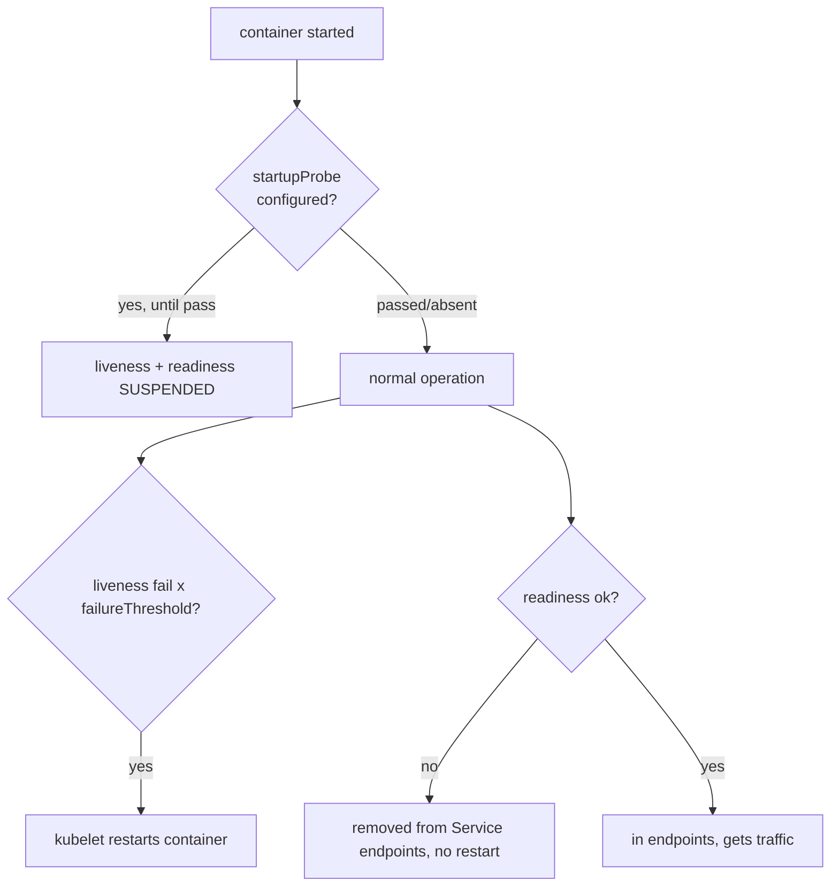

# Probes: Liveness, Readiness, Startup & Timing

Three probe types, three jobs. Confusing them causes either outages (liveness pointed at a dependency) or false "ready" pods (no readiness gate).

| Probe | On failure | Use for |
|---|---|---|
| **liveness** | restart the container | detect deadlocks / wedged process |
| **readiness** | remove from Service endpoints (no restart) | gate traffic during warm-up, load, or transient dependency loss |
| **startup** | hold the other two; on exhaustion, restart | slow-booting apps (JVM, large caches) |

## Timing parameters

| Field | Default | Notes |
|---|---|---|
| `initialDelaySeconds` | 0 | delay before first probe; prefer a `startupProbe` over a large value |
| `periodSeconds` | 10 | probe interval |
| `timeoutSeconds` | 1 | per-attempt timeout — often too tight for cold/GC paths |
| `failureThreshold` | 3 | consecutive failures before acting |
| `successThreshold` | 1 | passes to recover; **must be 1** for liveness/startup |

**Startup budget** = `failureThreshold × periodSeconds`. For a service that can take 2 min to boot: `startupProbe` with `periodSeconds: 10, failureThreshold: 18` → 180s of grace, during which liveness can't kill it.

## Probe methods

`httpGet` (2xx/3xx = pass), `tcpSocket` (connect = pass), `exec` (exit 0 = pass), and `grpc` (native gRPC health check, stable on modern K8s). `exec` probes are the most expensive (fork per probe) and can themselves cause load.

## Failure modes (interview gold)

- **Liveness on a shared dependency**: a liveness probe that pings the DB means one DB blip restarts *every* pod simultaneously — a self-inflicted, cluster-wide outage. Health-check only the local process; gate dependencies with **readiness** (traffic stops, pods survive, recover when the DB returns).
- **`timeoutSeconds: 1` + GC pause**: a stop-the-world GC longer than 1s fails the probe → spurious restarts under load, exactly when you can least afford them.
- **No readiness probe**: rolling updates (§1.6) send traffic to pods that aren't warm → 502s during deploy. Readiness is what makes rollouts zero-downtime (§1.7).
- **Readiness that never recovers**: with a `successThreshold > 1` set too high, a flapping pod may never rejoin endpoints.

**Interview angle:** "liveness vs readiness, and one config that causes an outage" → liveness restarts, readiness gates; pointing liveness at the DB causes synchronized restarts on a dependency blip.
