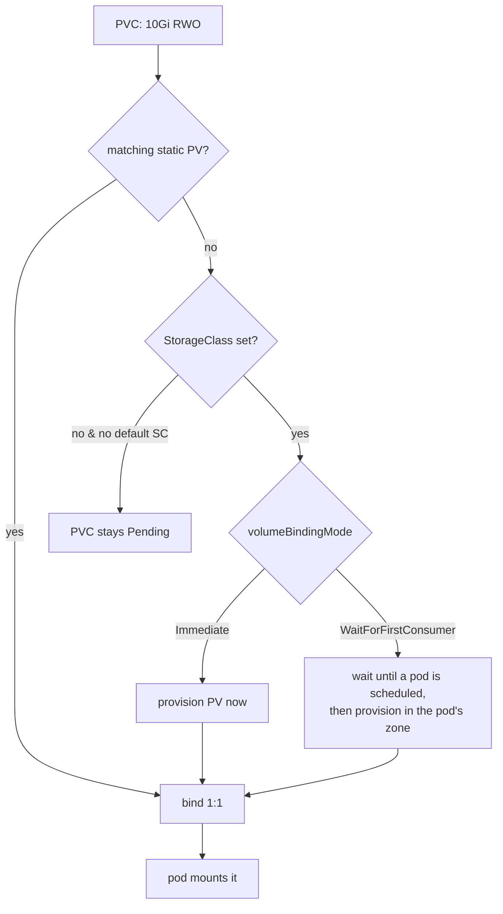

# PV / PVC / StorageClass — Binding & Reclaim

Three objects, clear separation of concerns:

- **PersistentVolume (PV)** — the *actual* storage (a cloud disk, NFS share, Ceph RBD). Cluster-scoped.
- **PersistentVolumeClaim (PVC)** — a *request* for storage ("I want 10Gi, RWO"). Namespaced; what pods reference.
- **StorageClass (SC)** — the *recipe* for dynamic provisioning (which CSI provisioner, parameters, reclaim/binding policy).

## Binding flow



A PVC and PV bind **1:1** and exclusively. `WaitForFirstConsumer` is critical for zonal disks: provisioning *before* scheduling can put the disk in a zone with no room for the pod, leaving it unschedulable. Delaying until the scheduler picks a node puts the disk in the right zone.

## Access modes

| Mode | Meaning | Typical backend |
|---|---|---|
| `ReadWriteOnce` (RWO) | one **node** mounts RW | block storage (EBS, PD) |
| `ReadWriteOncePod` | one **pod** mounts RW | stricter RWO (CSI) |
| `ReadOnlyMany` (ROX) | many nodes mount RO | shared read |
| `ReadWriteMany` (RWX) | many nodes mount RW | NFS, CephFS, EFS |

A common error: trying to mount an EBS-backed RWO PVC on two nodes (e.g. a Deployment with 2 replicas) — the second pod hangs on attach. Use RWX-capable storage for shared writes.

## Reclaim policy (what happens on PVC delete)

The PV's `reclaimPolicy`:
- **Delete** (default for dynamically provisioned): the underlying disk is destroyed with the PVC. Convenient, dangerous.
- **Retain**: the PV is kept, moves to `Released`, data preserved — but it won't auto-rebind; an admin must manually recycle/clean and re-create a PV to reuse the disk.

```yaml
kind: StorageClass
metadata: { name: fast-retain }
provisioner: ebs.csi.aws.com
reclaimPolicy: Retain
volumeBindingMode: WaitForFirstConsumer
allowVolumeExpansion: true
```

## Expansion

`allowVolumeExpansion: true` lets you grow a PVC by editing `.spec.resources.requests.storage` (online for many CSI drivers). **Shrinking is not supported.**

## Gotchas

- **No default StorageClass + no SC on the PVC** → PVC stuck `Pending` forever (classic "my pod won't start").
- `reclaimPolicy: Delete` + an accidental `kubectl delete pvc` = gone data. Use `Retain` for anything precious.
- [StatefulSet](deep:p2-statefulset) PVCs persist after deletion by default — separate from reclaim policy; the retention policy governs PVC deletion, reclaim governs the disk after that.

**Interview angle:** PV = disk, PVC = request, SC = recipe; binding is 1:1; `WaitForFirstConsumer` solves zone placement; `Delete` vs `Retain` decides whether your data survives a PVC deletion.
