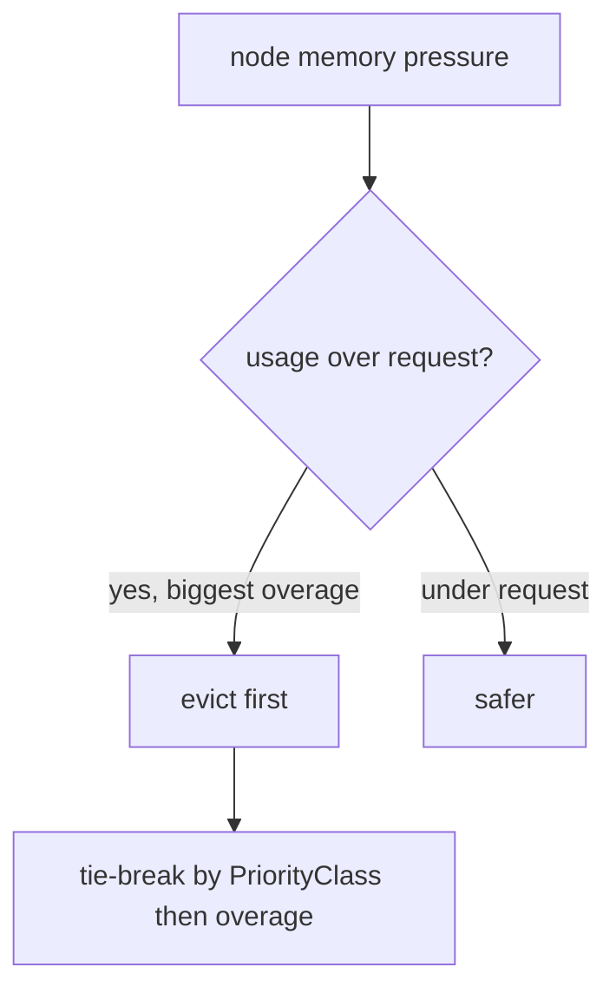

# QoS Classes, Eviction Ordering & CPU Throttling

QoS class is **derived**, not set — Kubernetes computes it from requests/limits:

| Class | Condition | `oom_score_adj` |
|---|---|---|
| **Guaranteed** | every container has `requests == limits` for *both* CPU and memory | -997 |
| **Burstable** | at least one request/limit set, but not Guaranteed | 2–999 (scaled) |
| **BestEffort** | no requests or limits anywhere | +1000 |

## Node-pressure eviction order (the real algorithm)

When a node crosses a soft/hard **eviction threshold** (e.g. `memory.available<100Mi`), the kubelet ranks pods to evict. It does **not** simply go BestEffort → Burstable → Guaranteed. It sorts by:

1. Whether the pod's usage **exceeds its memory request** (over-request pods first), then
2. **Priority** (`PriorityClass`), then
3. How far usage exceeds the request.

So a **Burstable** pod sitting *under* its request can outlive a Burstable pod *over* its request, and BestEffort (request = 0, so always "over") is always a top candidate. Guaranteed pods set `requests == limits`, so they're essentially never "over request" from memory — that's why they're evicted last.

## Kernel OOM vs kubelet eviction

Two different mechanisms:
- **kubelet eviction**: proactive, threshold-based, graceful (terminates pods, can have a grace period for soft eviction).
- **kernel OOM killer**: reactive, fires when memory is genuinely exhausted or a container hits its memory **limit**; uses `oom_score_adj` (above) so BestEffort dies first. A container over its own memory *limit* is OOM-killed regardless of node pressure.

## CPU throttling (the silent latency killer)

CPU limits are enforced via the CFS scheduler: the limit becomes a **quota per 100ms period** (`cpu.cfs_quota_us`). If a container exhausts its quota mid-period it's **throttled** until the next period — even if the node is idle. A pod with `limits.cpu: 500m` gets 50ms of CPU per 100ms; a burst that needs 80ms in one period stalls for 20ms. Symptoms: p99 latency spikes with low average CPU. Check `container_cpu_cfs_throttled_periods_total`. Many teams set CPU **requests** but no CPU **limit** to avoid this.

**Gotcha / interview angle:** "Which pod dies first under memory pressure?" — the precise answer is *the one most over its memory request* (then by priority), not merely "BestEffort." And CPU limits cause throttling, not killing; memory limits cause OOM-kill, not throttling. Protect a critical pod with Guaranteed QoS + a high [PriorityClass](deep:p2-poddisruptionbudget).
