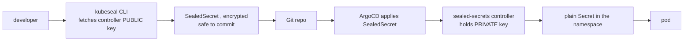

# Sealed Secrets

Sealed Secrets (Bitnami project) solves one problem: **how do I commit a Secret to Git safely?** It uses asymmetric crypto so the *encrypted* form is safe in a public repo and only the in-cluster controller can decrypt it.

## Mechanism



The controller generates an RSA key pair on first install. `kubeseal` encrypts using the public key; only the controller's private key (a Secret in `kube-system`) can unseal. The `SealedSecret` is a CRD; the controller watches it and emits a regular `Secret` as an owned child, so deleting the SealedSecret garbage-collects the Secret.

```bash
kubectl create secret generic db --from-literal=pw=s3cr3t --dry-run=client -o yaml \
  | kubeseal --controller-namespace kube-system -o yaml > sealed-db.yaml
```

## Scope modes (a common gotcha)

Encryption is bound to **name + namespace** by default (`strict` scope) to stop a SealedSecret being copied into another namespace to unseal it elsewhere:

- `strict` (default): tied to exact name **and** namespace.
- `namespace-wide`: any name, fixed namespace.
- `cluster-wide`: any name/namespace (use sparingly).

Rename or move a `strict` SealedSecret and it **won't unseal** — a frequent "it worked yesterday" failure.

## Key rotation & backup

The controller rotates its sealing key periodically (default ~30 days) but **keeps old keys** so existing SealedSecrets still decrypt. The critical operational task: **back up the controller's private keys** (`kubectl get secret -n kube-system -l sealedsecrets.bitnami.com/sealed-secrets-key -o yaml`). Lose them and every committed SealedSecret is unrecoverable — you must re-seal everything against a new key.

## Sealed Secrets vs External Secrets

- Sealed Secrets: ciphertext lives **in Git**; per-cluster (key-bound); rotation = re-seal + commit. Great for a single cluster / simple GitOps.
- [External Secrets](deep:p2-external-secrets): only a **pointer** in Git; real value in Vault/cloud SM; rotation needs no commit. Better at fleet scale.

**Interview angle:** asymmetric design means the public key can be shared freely; the blast radius of a leaked SealedSecret is zero without the controller's private key — but losing that private key (no backup) means total loss. Note Bitnami's image catalog moved to a legacy/Chainguard-sourced model in 2025; pin the controller image deliberately.
