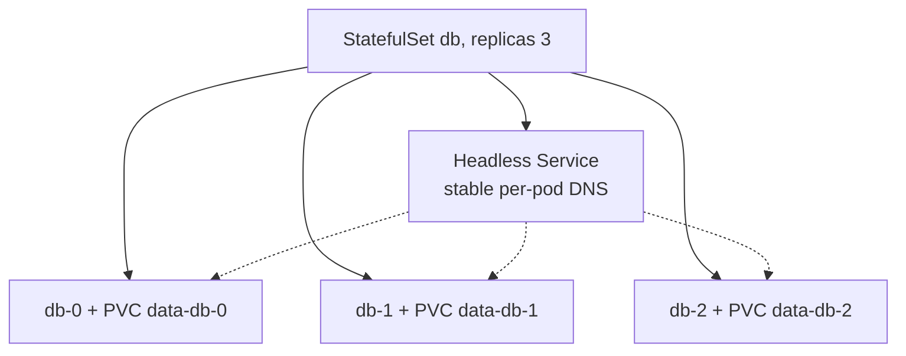

# StatefulSets — Identity, Ordering & PVC Retention

A StatefulSet gives pods what a Deployment deliberately denies them: **stable identity** and **stable per-pod storage**. That's why databases, Kafka, ZooKeeper, and other peer-aware systems use it.

## The three guarantees

1. **Stable network identity**: pods are named `<set>-0..N-1` (ordinal, not random hash). With a **headless Service** (`clusterIP: None`) each gets a stable DNS name `<set>-N.<svc>.<ns>.svc.cluster.local`. Peers can hardcode `db-0` as the primary.
2. **Stable storage**: `volumeClaimTemplates` creates **one PVC per pod** (`data-db-0`, `data-db-1`...). These are **not shared** — each pod owns its disk. A rescheduled `db-1` reattaches *its* PVC.
3. **Ordered operations**: by default pods are created/scaled **in order** (`db-0` Ready before `db-1` starts) and deleted in **reverse** (`db-2` before `db-1`). Rolling updates also go highest-ordinal-first.



## PVC retention policy (the money gotcha)

By default, deleting or scaling down a StatefulSet **leaves the PVCs behind** — intentional, so you don't lose DB data on an accidental scale-down. The downside: orphaned cloud disks keep costing money. The `persistentVolumeClaimRetentionPolicy` (GA in recent K8s) lets you opt into cleanup:

```yaml
spec:
  persistentVolumeClaimRetentionPolicy:
    whenScaled:  Delete   # delete PVCs of removed ordinals on scale-down
    whenDeleted: Retain   # keep PVCs when the whole set is deleted
```

Even with `Delete`, the underlying disk's fate then depends on the PV `reclaimPolicy` ([Delete vs Retain](deep:p2-pv-pvc-storageclass)).

## podManagementPolicy

- `OrderedReady` (default): strict sequential start/stop.
- `Parallel`: start/stop all pods at once — faster for systems that don't need ordered bootstrap (still keeps stable identity + storage).

## Failure modes

- **No headless Service** → no stable DNS; peers can't find each other.
- **Scale 5→3→5** brings `db-3`/`db-4` back bound to their *original* PVCs (old data) unless `whenScaled: Delete` — surprising if you expected fresh disks.
- A stuck `db-0` (CrashLoop) **blocks** `db-1`+ from starting under `OrderedReady` — one bad pod halts the rollout.
- `ReadWriteOnce` PVCs mean a pod can only run where its volume can attach (zone-pinned with `WaitForFirstConsumer`).

**Interview angle:** "Deployment vs StatefulSet?" → stable ordinal identity + stable per-pod PVC + ordered lifecycle, fronted by a headless Service. And know that PVCs survive deletion by default unless you set the retention policy.
