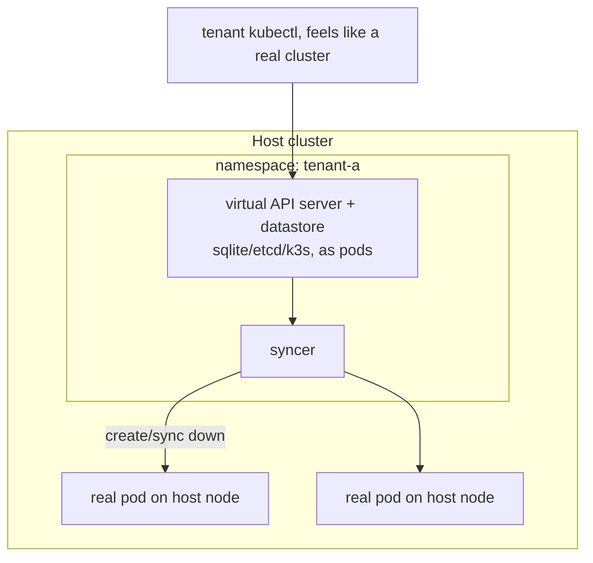

# vcluster — Virtual Clusters & the Syncer

A vcluster is a fully functional Kubernetes control plane running **as pods inside a single namespace** of a host cluster. Tenants get their own API server, their own CRDs, and cluster-admin — but the workloads actually run on the host's nodes. It's the middle ground between weak namespace isolation and expensive separate clusters.

## Architecture

## What lives where

- **Virtual control plane**: its own API server + datastore (often k3s + sqlite, optionally embedded etcd). Tenant CRDs, RBAC, namespaces, and most objects exist **only** in the virtual API server — invisible to and isolated from the host.
- **The syncer**: the heart of vcluster. It watches "real" workload objects in the virtual cluster (primarily **Pods**) and creates **rewritten copies** in the single host namespace so they actually schedule on host nodes. Names are rewritten (e.g. `pod-x-namespace-vcluster`) to avoid collisions.

## What syncs down vs stays virtual

- **Synced down** (must run on real nodes): Pods, and the things they need to run — Services, Endpoints, ConfigMaps/Secrets they reference, PVCs.
- **Stays virtual** (high-level/control objects): Deployments, StatefulSets, ReplicaSets, CRDs, RBAC, the tenant's own operators. The virtual cluster's own controllers produce the Pods; the syncer pushes those Pods down. This is why a tenant can install any CRD/operator without touching the host.

## Why it's strong-ish isolation

- Separate API server → tenant can be **cluster-admin** of *their* cluster without any power over the host or peers.
- Separate CRDs → no shared CRD version conflicts (the classic namespace-multitenancy pain).
- Blast radius: breaking your vcluster's API server doesn't affect the host or other tenants.

## Gotchas

- **Pods really run on host nodes** — host **NetworkPolicy**, **ResourceQuota**, node capacity, PodSecurity, and taints still apply. Isolation is at the control-plane layer, not the node layer.
- **Resource accounting**: a runaway tenant consumes shared node capacity; cap it with host-side quotas/limits on the vcluster's namespace.
- Cross-namespace features inside the vcluster map onto one host namespace by default — multi-namespace sync modes exist but add complexity.
- Great for **CI, preview environments, per-team sandboxes** where you need real CRDs/admin cheaply; less suited where you need hard node-level/network isolation (use separate clusters then, §2.7).

**Interview angle:** "Team needs cluster-admin + own CRDs without risking prod?" → vcluster: real virtual API server + CRDs + admin in one host namespace, with the **syncer** projecting their Pods onto shared host nodes. Namespaces can't grant admin/CRDs; full clusters cost too much.
