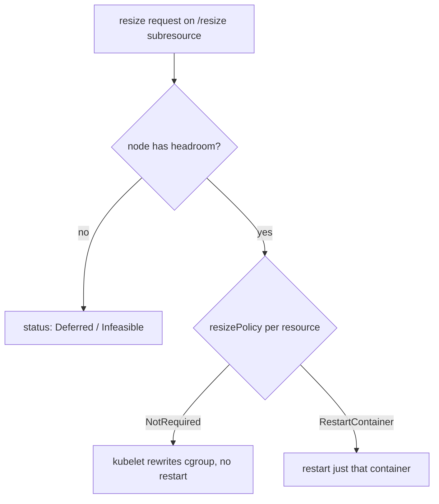

# In-Place Pod Resize & VPA InPlaceOrRecreate

Historically, changing a Pod's CPU/memory **requests/limits** required deleting and recreating the Pod — disruptive for stateful or singleton workloads. **In-place pod resize** removes that constraint: the kubelet patches the container's cgroup limits on a running Pod.

## Status (as of 2026)

The feature (`InPlacePodVerticalScaling`) reached **GA in Kubernetes 1.33** (mid-2025) and is stable through 1.35. It exposes a dedicated **`resize` subresource** on the Pod and a per-container `resizePolicy`.

```yaml
spec:
  containers:
    - name: app
      resources:
        requests: { cpu: 200m, memory: 256Mi }
        limits:   { cpu: 500m, memory: 512Mi }
      resizePolicy:
        - { resourceName: cpu,    restartPolicy: NotRequired }
        - { resourceName: memory, restartPolicy: RestartContainer }
```

```bash
# patch resources live, no pod recreation
kubectl patch pod app --subresource resize --patch \
  '{"spec":{"containers":[{"name":"app","resources":{"requests":{"cpu":"400m"}}}]}}'
```



## How VPA uses it

The Vertical Pod Autoscaler (VPA, §2.3.4) gained an update mode **`InPlaceOrRecreate`**: it attempts an in-place resize first and falls back to eviction/recreate only when in-place isn't possible (e.g. node lacks headroom, or memory shrink needs a restart). This means right-sizing no longer always evicts the Pod — a big deal for databases and other stateful singletons.

| VPA mode | Behaviour |
|---|---|
| `Off` | recommend only (safe default — read recommendations, apply by hand) |
| `Initial` | set requests at creation only |
| `Recreate` | evict + recreate to apply (legacy, disruptive) |
| `InPlaceOrRecreate` | resize live where possible, else recreate |

## Constraints & gotchas

- Requires **cgroup v2**.
- **CPU/memory only** — not ephemeral storage or other resources.
- **Memory shrink** typically needs `RestartContainer` (you can't safely yank memory from a running process), so it's not always disruption-free.
- A resize the node can't satisfy stays **`Deferred`/`Infeasible`** — it doesn't trigger node autoscaling on its own; pair with [Karpenter](deep:p2-karpenter)/[CA](deep:p2-cluster-autoscaler) if you need more node room.
- Don't combine VPA and [HPA](deep:p2-hpa-algorithm) on the same metric — they fight (VPA changes the request, HPA scales on % of that request).

**Interview angle:** "How do you right-size a stateful pod without downtime in modern K8s?" → in-place resize (GA 1.33+) via the `resize` subresource, driven by VPA `InPlaceOrRecreate`, with the caveat that memory shrink may still restart the container.
