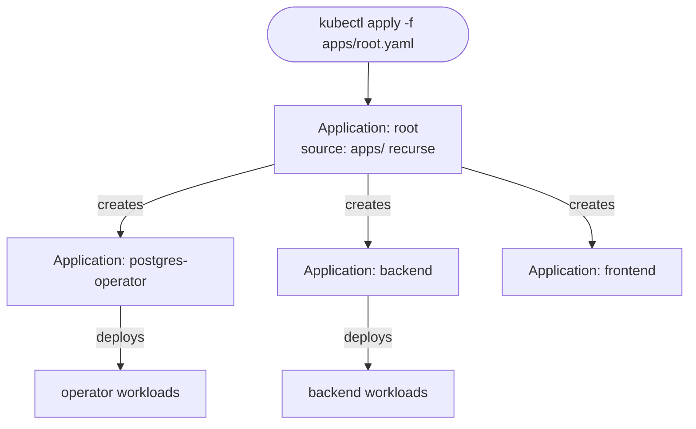

# App-of-Apps Pattern

The **app-of-apps** pattern bootstraps an entire ArgoCD setup from a single root `Application`. You `kubectl apply` the root once; it points at a directory of *more* `Application` manifests; ArgoCD syncs the root, which **creates the children**, which in turn deploy the real workloads (§2.6, §3.2).

```yaml
# apps/root.yaml — applied by hand exactly once
apiVersion: argoproj.io/v1alpha1
kind: Application
metadata:
  name: root
  namespace: argocd
spec:
  project: default
  source:
    repoURL: https://github.com/you/my-platform.git
    targetRevision: main
    path: apps                # folder full of child Application YAMLs
    directory:
      recurse: true           # pick up nested app manifests
  destination:
    server: https://kubernetes.default.svc
    namespace: argocd         # children are ArgoCD objects -> live in argocd ns
  syncPolicy:
    automated: { prune: true, selfHeal: true }
```



**Why it's powerful:** the whole platform is declarative and Git-tracked, including *which apps exist*. Add a service = commit a new `apps/<svc>.yaml`; delete one = delete the file and `prune` removes it. The root is the only manual `kubectl` touch.

**Children are ArgoCD objects.** The root's `destination.namespace` is `argocd` because it creates `Application` CRs (which live in the argocd namespace), **not** the workloads. Each child has its *own* destination namespace for the actual app. Confusing these is a classic setup bug.

**Ordering still applies.** Children carry [sync waves](deep:p3-sync-waves) so operators come up before their CRs, infra before backends (§3.2 CS3). The root itself can be early-wave.

**App-of-apps vs [ApplicationSet](deep:p3-applicationset).** App-of-apps = you *hand-write one Application file per child*; great when each is genuinely different (different charts, values, waves). ApplicationSet = a controller **generates** child Applications from a generator (list/git/cluster/matrix), great for *templated multiplicity* (same app across many clusters/regions/PRs). Many real platforms use both: ApplicationSet to fan an app across clusters, app-of-apps to assemble a heterogeneous stack.

**Gotchas:** `prune: true` on the root means deleting a child file deletes the app — powerful and dangerous; protect with an AppProject and review. A child stuck unhealthy doesn't necessarily block siblings unless waves enforce it. Self-heal on the root fights manual edits to child Applications (by design). Cascading delete: deleting the root with a foreground finalizer can tear down everything.

**Interview angle:** "How do you bootstrap a cluster's apps in GitOps with one command?" Root app-of-apps + recurse + waves; and know when to switch to ApplicationSet generators.
