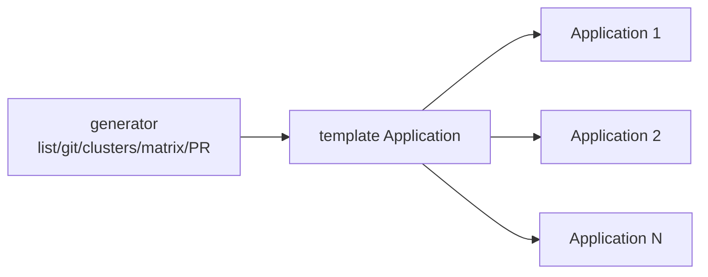

# ApplicationSet and Generators

`ApplicationSet` is an ArgoCD controller (core/stable in the ArgoCD v2.x → v3.x line) that **generates** `Application` resources from a template plus a **generator**. Where [app-of-apps](deep:p3-app-of-apps) means hand-writing one Application file per child, an ApplicationSet produces N Applications from one spec — ideal for "same app across many clusters / regions / tenants / PRs."

```yaml
apiVersion: argoproj.io/v1alpha1
kind: ApplicationSet
metadata:
  name: backend-per-cluster
  namespace: argocd
spec:
  generators:
    - clusters: {}                 # one Application per registered cluster
  template:
    metadata:
      name: 'backend-{{name}}'     # {{name}} from the generator
    spec:
      project: default
      source:
        repoURL: https://github.com/you/my-platform.git
        targetRevision: main
        path: charts/app
      destination:
        server: '{{server}}'       # the cluster's API server
        namespace: myapp
      syncPolicy: { automated: { prune: true, selfHeal: true } }
```

**Generators (the toolbox):**

| Generator | Produces an Application per... | Typical use |
|---|---|---|
| `list` | static list entry | a few fixed environments |
| `clusters` | registered cluster (by label selector) | fan one app across fleet |
| `git` (directories) | sub-directory in a repo | app-per-folder (monorepo) |
| `git` (files) | matched config file | per-file parameter sets |
| `scmProvider` / `pullRequest` | repo / open PR | preview/ephemeral envs per PR |
| `matrix` | cartesian product of two generators | app × cluster |
| `merge` | combined params keyed across generators | overlay overrides |



**vs app-of-apps:** app-of-apps assembles a **heterogeneous** stack (operator, DB, backend, frontend — each different). ApplicationSet templates **homogeneous multiplicity** (the same app many times with parameter substitution). They compose: an ApplicationSet can even generate the children of an app-of-apps.

**The `pullRequest` generator** is the killer feature for **ephemeral preview environments** — open a PR, get a namespace/app; close it, ArgoCD prunes it. Pairs with `goTemplate: true` for richer templating (`{{.branch}}`, sprig functions).

**Gotchas:** by default ApplicationSet deletion **cascades** to generated Applications (and their workloads) — guard with `preserveResourcesOnDeletion`. A misconfigured generator can spawn or delete many apps at once (blast radius). `goTemplate: true` changes `{{}}` semantics vs the legacy fasttemplate — pick one. Parameter typos silently generate broken Applications. Use an AppProject to bound what generated apps may deploy.

**Interview angle:** "Same service across 20 clusters — app-of-apps or ApplicationSet?" ApplicationSet with the `clusters` generator; mention `pullRequest` for preview envs and the cascade-delete blast-radius caveat.
