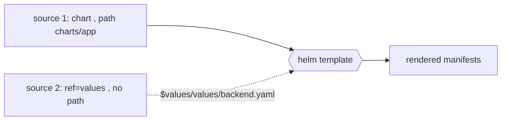

# ArgoCD Multi-Source Applications and the $values Ref

A single ArgoCD `Application` can declare **multiple `sources`** (GA in the ArgoCD v2.6+/v3.x line). The headline use (§2.6, §3.2): keep a Helm chart in one place and its values file in *another* place of the *same or different* repo, and still render them together.

```yaml
spec:
  sources:
    - repoURL: https://github.com/you/my-platform.git
      targetRevision: main
      path: charts/app                       # the chart
      helm:
        valueFiles:
          - $values/values/backend.yaml       # reaches into the ref source
    - repoURL: https://github.com/you/my-platform.git
      targetRevision: main
      ref: values                            # names this source "$values"
```

**How `$values` works.** A source with **only** a `ref:` and no `path`/`chart` contributes **no manifests** — it just mounts that repo's checkout under the name `$values`. Other sources reference files inside it as `$values/<path>`. This is purely a *value-file resolution* mechanism; the ref source itself renders nothing.



**Why not just one source?** Because the chart and its env-specific values often live in different folders/repos (or the chart is upstream OCI and values are yours). `$values` lets the chart stay pristine while you layer config.

**`valueFiles` vs inline.** Alternatives to a values *file*: `helm.valuesObject:` (structured inline YAML, preferred on modern ArgoCD) or the older `helm.values: |` string. Inline drops the need for a `values/` folder but loses file reuse. Ordering of `valueFiles` mirrors `-f` precedence — last wins ([values precedence](deep:p3-values-precedence)).

**Last-source-wins on duplicate resources.** If two *manifest-producing* sources emit the **same** resource (same group/kind/name/namespace), the **last source in the list wins**, and ArgoCD raises a `RepeatedResourceWarning`. This mirrors Helm's "last `-f` wins" mental model but operates at the rendered-resource layer, not the values layer. Don't rely on it deliberately — it signals an overlap bug.

**Gotchas:**
- A `ref` source still needs a valid `repoURL`/`targetRevision`; mismatched `targetRevision` between chart and values sources gives subtle drift.
- `$values` only resolves in `valueFiles`, not arbitrary chart paths.
- Multi-source Applications historically had thinner UI support (per-source diffing) than single-source — improved across v3.x but worth checking your version.
- Mixing an OCI chart source + a Git values ref is supported and common for upstream charts ([Bitnami sourcing](deep:p3-bitnami-sourcing)).

**Interview angle:** "Chart upstream, values in your Git — how?" Multi-source with a `ref` source and `$values/...` valueFiles; and explain last-source-wins + RepeatedResourceWarning as the analog of Helm's last-`-f`-wins.
