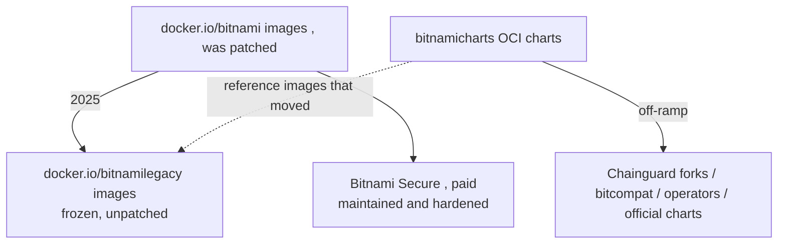

# The Bitnami Sourcing Situation

For years "just use the Bitnami chart" was the default for Redis, Kafka, PostgreSQL, MongoDB, etc. In **2025 Broadcom (VMware) restructured the Bitnami catalog**, which broke that assumption and is now a standard interview topic.

**What changed (mid/late 2025):**

| Before | After |
|---|---|
| `docker.io/bitnami/:<tag>` actively patched | Public images frozen and **moved to `docker.io/bitnamilegacy/`** — a read-only, no-longer-updated archive |
| Full versioned tag history on Docker Hub | Public Docker Hub limited largely to `latest`; pinned/hardened tags behind a subscription |
| Free hardened images | **Bitnami Secure** — the paid subscription for maintained, CVE-patched, FIPS/STIG images |
| `docker.io/bitnamicharts/<chart>` (OCI) | Still published, but point at images that moved → break unless you override |

So the charts often still *install*, but pods hit `ImagePullBackOff` or run stale images because the referenced repo is frozen or gone (§3.4 Q3).

**Off-ramps (free):**

- **[Chainguard](deep:p3-chainguard)** — publishes drop-in chart/image forks of the Bitnami catalog built on minimal, frequently-rebuilt Wolfi images. Closest to "just swap the registry."
- **bitcompat** — community project republishing Bitnami-compatible images/tags so existing charts keep working without rewriting values.
- **Official upstream charts** — e.g. `yugabytedb/yugabyte`, the PostgreSQL operator [CloudNativePG](deep:p3-cloudnativepg), `redis` via a Redis operator.
- **Operators** — [Strimzi](deep:p3-strimzi) for Kafka, CloudNativePG for Postgres — generally the production answer over a stateful Helm chart anyway (§2.5, CS3).

**The portable rule (whatever you choose):**

1. **Pin the chart version** (`targetRevision`/`--version`) — never float.
2. **Override every image reference** (`image.registry`/`image.repository`) to a registry you trust and control (mirror, Chainguard, your own).
3. Preview with `helm template ... | grep image:` to confirm no `bitnami/` or `bitnamilegacy/` slipped through transitively (subcharts!).

**Gotchas:** the Bitnami `common` library subchart ([library chart](deep:p3-library-chart)) is a transitive dep of most Bitnami charts — forks must ship a compatible `common`. Image overrides must reach **subchart** values too (`<subchart>.image.registry`). `bitnamilegacy` receives **no CVE fixes** — fine for a lab, not for prod.

**Interview angle:** explain why a previously-working chart now `ImagePullBackOff`s, and name three off-ramps (Chainguard, bitcompat, operators) plus the two invariants: pin versions, override images.
