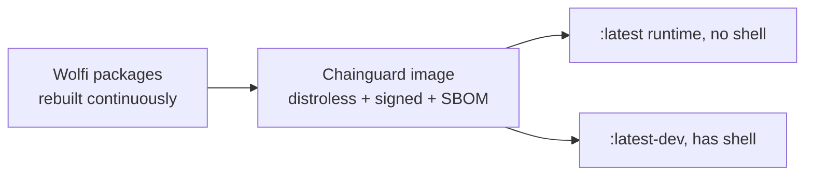

# Chainguard Images and Bitnami Forks

**Chainguard Images** are minimal, hardened container images built on **Wolfi** (a glibc, container-native "undistro"). They became prominent as a free off-ramp from the deprecated public Bitnami catalog ([Bitnami sourcing](deep:p3-bitnami-sourcing)) because Chainguard publishes drop-in **forks of the Bitnami charts and images**.

**What makes them different:**

| Property | Typical distro image | Chainguard / Wolfi image |
|---|---|---|
| Base | full OS userland | minimal, often **no shell, no package manager** in the runtime variant |
| CVE posture | patched on the distro's cadence | rebuilt frequently, aims for near-zero known CVEs |
| Provenance | varies | ships **SBOM + Sigstore signatures**, attestations |
| Size / attack surface | larger | small, fewer packages = fewer CVEs |

**`-dev` vs runtime variants.** Chainguard ships a `:latest` runtime image (distroless-style, no shell) and a `:latest-dev` variant *with* a shell/apk for debugging. A chart that runs an init shell script or `exec`s into the container needs the `-dev` tag or a different approach — this is the most common migration snag.



**Using them as a Bitnami drop-in:** repoint the chart's image values at the Chainguard registry and pin a tag. Because Chainguard mirrors the Bitnami chart structure, the values keys usually line up:

```yaml
# values/redis.yaml — repointed off bitnamilegacy
image:
  registry: cgr.dev
  repository: chainguard/redis    # illustrative; confirm exact repo path
  tag: "<pinned>"
```

**Free vs paid.** Chainguard offers a set of **free, latest-only** public images plus a commercial tier with **version-pinned tags, longer support, and FIPS** builds. The free tier moving tags (only `:latest`) is a real GitOps tension — you want to pin, but the free image may only expose `latest`. Mirror into your own registry with a digest pin (`@sha256:...`) to get reproducibility, or use the paid tier for pinned tags.

**Gotchas:** distroless images break `kubectl exec sh` debugging — use `kubectl debug` with an ephemeral container or the `-dev` tag. Hardcoded paths/UIDs in upstream charts may not match the Wolfi layout. Always verify signatures (`cosign verify`) if you depend on the provenance story. Confirm exact registry/repo paths against current Chainguard docs — they evolve.

**Interview angle:** "How do you replace Bitnami images safely?" Chainguard/Wolfi drop-in + pin by digest (or mirror), and know the `-dev` vs distroless trade-off for debugging.
