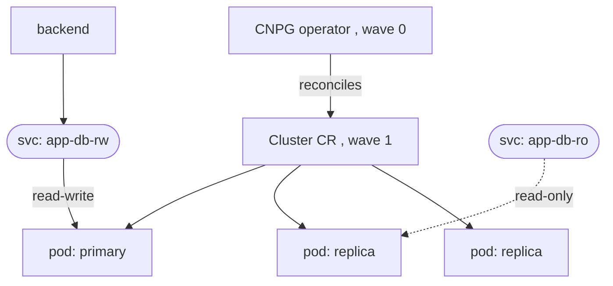

# CloudNativePG

**CloudNativePG (CNPG)** is a Kubernetes operator for PostgreSQL (a CNCF project, donated by EDB; in the Incubating track). It runs Postgres as a first-class, cloud-native workload — the production answer for the capstone (§3.3 CS3) versus a hand-rolled StatefulSet (CS2) or a deprecated Bitnami chart ([Bitnami sourcing](deep:p3-bitnami-sourcing)).

**The model: a `Cluster` CR, not a chart-of-StatefulSet.** You install the operator (wave 0, [sync waves](deep:p3-sync-waves)), then declare a `Cluster`; the operator reconciles primary + replicas, failover, backups, and connection routing.

```yaml
apiVersion: postgresql.cnpg.io/v1
kind: Cluster
metadata:
  name: app-db
spec:
  instances: 3                     # 1 primary + 2 replicas
  storage:
    size: 20Gi
    storageClass: fast-ssd
  bootstrap:
    initdb:
      database: app
      owner: app                   # operator creates the user + a Secret
  backup:
    barmanObjectStore:
      destinationPath: s3://my-bucket/cnpg
      # WAL archiving + base backups to object storage
```

**No sidecar/Patroni.** Unlike many Postgres operators, CNPG manages instances **directly** (no Patroni, no separate DCS) and uses the **Postgres replication protocol** plus the Kubernetes API as the source of truth. It creates **services for routing**:

| Service | Routes to |
|---|---|
| `<cluster>-rw` | current **primary** (read-write) — backends connect here |
| `<cluster>-ro` | replicas (read-only) |
| `<cluster>-r` | any instance |



**Failover & Day-2.** On primary loss, CNPG promotes a replica and **repoints the `-rw` Service** automatically — the backend's connection string (`app-db-rw`) never changes; it just reconnects (§2.3 retry; this is why the app must tolerate blips, [sync waves](deep:p3-sync-waves)). It also handles rolling minor upgrades, scale-up by adding replicas, and PITR from the WAL archive. Credentials are published as a **Secret** the backend mounts (§2.2) — CS3's "operator publishes creds" pattern.

**vs raw StatefulSet (CS2).** A StatefulSet (§2.4) gives stable identity + per-pod PVC but **no** failover, backups, or topology logic — you'd script all Day-2 ops. The operator (§2.5) encodes them as a controller. That's the CS2→CS3 lesson: primitives vs production.

**Gotchas:** **always connect to `-rw`**, never a pod DNS name, or you'll write to a demoted replica after failover; size `storage` up front (online resize depends on the StorageClass allowing volume expansion); backups need object-store creds + tested **restore** (a backup you haven't restored isn't a backup); operator CRDs must exist before the `Cluster` (wave ordering). Verify exact current API/version against CNPG docs.

**Interview angle:** "Operator vs StatefulSet for Postgres?" Operator adds failover/backups/upgrades as a controller and gives a primary-tracking `-rw` Service; StatefulSet only gives identity + storage.
