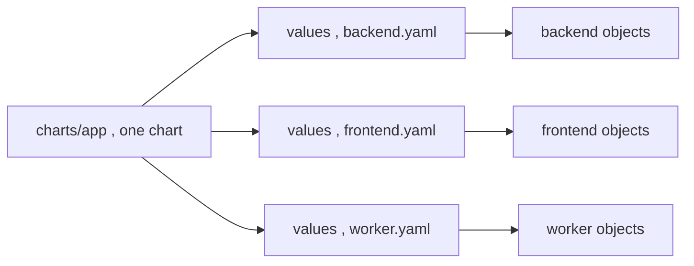

# The Generic App Chart

The core repo decision (§3.2, SETUP): **one** chart `charts/app` renders a Deployment + Service + ConfigMap (+ optional gated Ingress) for *every* first-party service, and each service is just a values file. This is the opposite of `helm create` per microservice.

**Why one chart works for backend AND frontend.** To the chart, both are "a container that reads env from a ConfigMap and exposes a port." The only frontend-specific behavior — writing runtime config at startup — lives in the **frontend image** ([Vite runtime config](deep:p3-vite-runtime-config)), not the chart. So per-app differences are all values: image, ports, env, probes, replicas, whether an Ingress renders.

**Everything must be gated and parameterized:**

```yaml
# charts/app/templates/ingress.yaml
{{- if .Values.ingress.enabled }}      # false here; routing lives in charts/ingress
apiVersion: networking.k8s.io/v1
kind: Ingress
# ...
{{- end }}
```

```yaml
# charts/app/templates/deployment.yaml (sketch)
spec:
  replicas: {{ .Values.replicaCount | default 2 }}
  template:
    metadata:
      annotations:
        checksum/config: {{ include (print $.Template.BasePath "/configmap.yaml") . | sha256sum }}
    spec:
      containers:
        - name: {{ include "app.name" . }}
          image: "{{ .Values.image.repository }}:{{ .Values.image.tag }}"
          {{- with .Values.command }}
          command: {{ toYaml . | nindent 12 }}
          {{- end }}
          envFrom:
            - configMapRef: { name: {{ include "app.fullname" . }}-config }
          {{- with .Values.readinessProbe }}
          readinessProbe: {{ toYaml . | nindent 12 }}
          {{- end }}
```

The `checksum/config` annotation (§2.1) rolls pods when config changes; `{{- with }}` blocks keep optional fields out of the manifest entirely when unset.



**Generic chart vs [library chart](deep:p3-library-chart) vs per-app chart.** Generic = same shape, vary *values* (this setup). Library (`type: library`) = share template *logic* across charts that differ structurally. Per-app chart = one service needs genuinely unique *templates*. Start generic; graduate only on real divergence (§3.4 Q4).

**Design rules for staying generic:** every feature behind an `if`/`with`; sensible defaults in `values.yaml`; never hardcode a service name; use `_helpers.tpl` for names/labels ([helpers.tpl](deep:p3-helpers-tpl)); keep Ingress optional and off (§1.8, single [ingress ownership](deep:p3-ingress-ownership)).

**Gotchas:** the chart becoming a kitchen sink (too many toggles) signals you actually need a per-app chart or a library chart; list-valued fields (`env`, `volumes`) don't merge across values files ([values precedence](deep:p3-values-precedence)); a missing default for an ungated field breaks every consumer at once.

**Interview angle:** "Adding a 6th service?" New `values/<svc>.yaml` + `apps/<svc>.yaml`; the chart is untouched — and explain when you'd stop using one generic chart.
