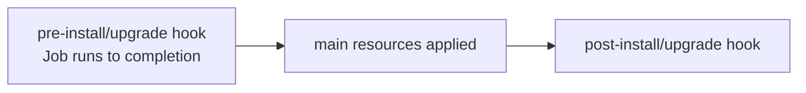

# Helm Hooks vs ArgoCD Sync Phases

Helm hooks let a chart run a resource (usually a `Job`) at a defined point in the release lifecycle. They're annotations on an otherwise-normal manifest:

```yaml
apiVersion: batch/v1
kind: Job
metadata:
  name: db-migrate
  annotations:
    "helm.sh/hook": pre-upgrade,pre-install
    "helm.sh/hook-weight": "0"
    "helm.sh/hook-delete-policy": before-hook-creation,hook-succeeded
```

**Hook points (order):** `pre-install` → (CRDs) → `post-install`; `pre-upgrade` → `post-upgrade`; `pre-rollback`/`post-rollback`; `pre-delete`/`post-delete`; plus `test` (run by `helm test`). Within a phase, `hook-weight` orders (low→high), then alphabetical. Hooks are **not** part of the main release manifest set, so Helm won't track/delete them like normal resources — hence `hook-delete-policy`.

**Critical: hooks block.** Helm waits for a `pre-install` Job to **complete** before rendering/applying the rest. This is how DB migrations gate an upgrade.



**The ArgoCD reality.** ArgoCD does **not** run `helm install`; it runs [`helm template`](deep:p3-helm-template-vs-install) and applies the output. So Helm's *runtime* hook machinery doesn't execute. Instead, ArgoCD **translates** Helm hook annotations into its own **resource hooks / sync phases**:

| Helm hook | ArgoCD phase |
|---|---|
| `pre-install`, `pre-upgrade` | `PreSync` |
| (none) main resources | `Sync` |
| `post-install`, `post-upgrade` | `PostSync` |
| `helm.sh/hook: test` | `argocd.argoproj.io/hook: Skip` / test |

ArgoCD also has native annotations: `argocd.argoproj.io/hook: PreSync|Sync|PostSync|SyncFail` and `hook-delete-policy: HookSucceeded|HookFailed|BeforeHookCreation`. So a migration Job works either way — write it as a Helm `pre-upgrade` hook and ArgoCD maps it to PreSync.

**Phases vs [sync waves](deep:p3-sync-waves).** Different axes. *Phases* (PreSync/Sync/PostSync) are coarse lifecycle stages within one sync. *Waves* (`sync-wave: "N"`) order resources **within** a phase. PreSync hooks run, then Sync waves run in order, then PostSync. A common bug: expecting a `sync-wave` to delay a PreSync hook — waves don't cross phases.

**Gotchas:** unmapped Helm hooks (e.g. `pre-delete` semantics) don't always translate cleanly; ArgoCD pruning + hook-delete-policy can race. A hook Job that never completes wedges the whole sync (Progressing forever). For pure ArgoCD shops, prefer native `argocd.argoproj.io/hook` annotations over Helm ones for clarity.

**Interview angle:** "Your Helm pre-upgrade migration — does it run under ArgoCD?" Yes, mapped to PreSync; but `lookup`-based hooks and `helm.sh/hook` ordering nuances can differ from a real `helm upgrade`.
