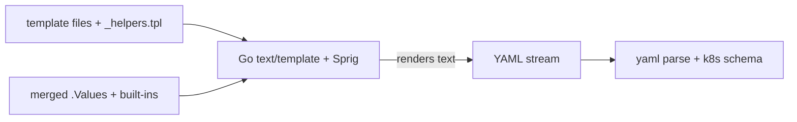

# Helm Template Engine Internals

Helm renders charts with Go's `text/template` plus the **Sprig** function library plus a handful of Helm-specific functions. The output is plain YAML that Helm (or ArgoCD via `helm template`, §3.1) then applies. Understanding the engine is mostly understanding what data and functions are in scope.

**The scope object (`.`)** carries everything:

| Built-in | Holds |
|---|---|
| `.Values` | merged values (defaults + `-f` + `--set`, §3.1 precedence) |
| `.Release` | `.Name`, `.Namespace`, `.Revision`, `.IsUpgrade`, `.IsInstall` |
| `.Chart` | `Chart.yaml` contents — `.Chart.Name`, `.Chart.AppVersion` |
| `.Capabilities` | `.KubeVersion`, `.APIVersions.Has "..."` — feature-gate templates |
| `.Files` | non-template files in the chart, via `.Files.Get` / `.Files.Glob` |
| `.Template` | `.Name` (current file path), `.BasePath` |

**Pipelines and whitespace.** `{{ .Values.x | default "y" | quote }}` flows left to right. The dash trims whitespace: `{{-` eats preceding whitespace, `-}}` eats trailing — essential to stop blank lines breaking YAML indentation. A stray space under a `{{- if }}` block is the #1 cause of "rendered fine, applied as invalid YAML".

**Render order matters for a subtle reason.** Helm renders all templates, concatenates, then splits on `---` and parses. So a template that renders to *empty* (everything behind a false `if`) is fine — it just contributes nothing. But a template that renders malformed text fails the whole release.

**Key engine functions** (beyond Sprig): `include` (call a named template and capture its output as a string — see [`_helpers.tpl`](deep:p3-helpers-tpl)), `tpl` (render a string *from values* as a template at runtime), `required "msg" .Values.x` (hard-fail on missing input), `lookup` (read live cluster state during render), `toYaml`/`fromYaml`, `b64enc`, `genCA`/`genSignedCert`. `include` is preferred over the built-in `template` action precisely because its output can be piped (`{{ include "x" . | indent 4 }}`); `template` cannot.

**`lookup` caveat:** during `helm template` (and thus ArgoCD) there is no cluster connection, so `lookup` returns an empty value. Templates that *depend* on `lookup` silently behave differently under ArgoCD than under `helm install` — a real gotcha for "generate a password only if the Secret doesn't exist" patterns.

**`tpl` use case:** let a value contain template syntax, e.g. `ingress.host: "{{ .Release.Name }}.example.com"` in `values.yaml`, then `{{ tpl .Values.ingress.host . }}` in the template. Powerful but a known injection/footgun surface.

**Gotchas:** Go templates have no real types — everything stringly compares; use `eq`, `ne`, `and`, `or` as functions, not operators. `nil` vs missing-key vs empty-string differ. Always preview with `helm template . | less` (§3.1).

**Interview angle:** be able to explain why `lookup` and Helm hooks behave differently under ArgoCD (`helm template`) than under `helm install` — see [helm template vs install](deep:p3-helm-template-vs-install).
