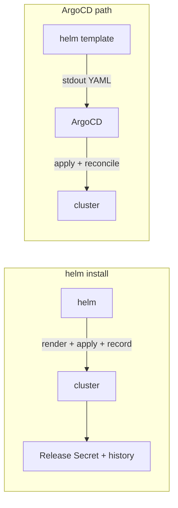

# helm template vs helm install (and why ArgoCD matters)

The single most consequential Helm distinction for a GitOps shop (§3.1, §3.4 Q1): does Helm **own** the release state, or does it just **render** YAML for someone else to apply?

| | `helm install` / `upgrade` | `helm template` |
|---|---|---|
| Talks to cluster | yes (applies + records) | **no** (pure stdout) |
| Stores a **Release** | yes (Secret in the namespace, revision history) | no |
| Runs **hooks** at runtime | yes (pre/post-install Jobs block) | no — hooks just render as annotated manifests |
| `lookup` reads live cluster | yes | **no** (returns empty) |
| `helm list` / `helm get` / `rollback` | work | nothing to list — empty |
| `.Capabilities.APIVersions` | from the live cluster | from a static/default set unless `--api-versions` passed |
| Who reconciles drift | Helm on next upgrade | whatever applies the output |

**ArgoCD uses `helm template`.** It renders the chart to plain manifests, then applies and **continuously reconciles** them itself. Consequences cascade:

- **No Helm release in the cluster.** `helm list` is empty; `helm get values`/`rollback` are useless. You debug with `argocd app manifests`, `argocd app diff`, and `kubectl`.
- **Rollback is Git, not Helm.** Revert the commit; ArgoCD re-syncs. There's no Helm revision history.
- **Hooks become ArgoCD phases.** Runtime hook machinery doesn't fire; ArgoCD maps Helm hook annotations onto PreSync/Sync/PostSync ([helm hooks](deep:p3-helm-hooks)).
- **`lookup` is empty at render.** "Generate a password only if the Secret doesn't exist" silently regenerates or breaks under ArgoCD ([helm template engine](deep:p3-helm-template-engine)). Use Sealed Secrets/ESO ([sealed vs external secrets](deep:p3-sealed-vs-external-secrets)) instead of `lookup`-based generation.
- **`.Capabilities`** can differ — pass `--api-versions`/`kubeVersion` (ArgoCD has settings for this) so API-version-gated templates render the same as in-cluster.

**Why this is the favorite interview question.** It forces you to connect Helm internals to operational reality: where state lives, how you roll back, why `helm list` is empty, and why a chart that relies on `lookup`/runtime hooks may behave differently than expected. The mental model: **Helm install = Helm owns state; ArgoCD = Git owns state, Helm is just a renderer.**

**Gotchas:** `helm template` doesn't validate against the live API server (no admission webhooks, no real CRD presence) — `--validate` needs a cluster; mismatched `--api-versions` causes "works in CI, drifts in cluster"; charts assuming a Release name/namespace still get `.Release.*` populated by ArgoCD, so that part is fine.

**Interview angle:** "Why does ArgoCD use `helm template`, and what breaks?" No Release/`helm list`, Git-based rollback, hooks→sync phases, `lookup` empty at render.
