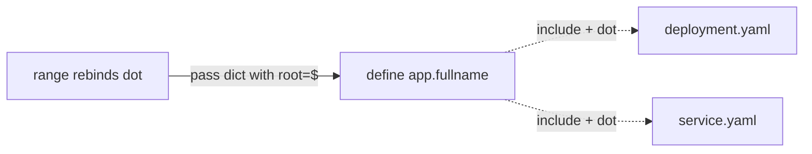

# _helpers.tpl and Named Templates

`templates/_helpers.tpl` is where reusable snippets live. Files beginning with `_` are **partials**: the engine parses them for `define` blocks but never renders them to a manifest (no `---` output). This is how `helm create` factors out names and labels.

**Defining and calling:**

```yaml
{{/* templates/_helpers.tpl */}}
{{- define "app.name" -}}
{{- default .Chart.Name .Values.nameOverride | trunc 63 | trimSuffix "-" -}}
{{- end -}}

{{- define "app.fullname" -}}
{{- if .Values.fullnameOverride -}}
{{- .Values.fullnameOverride | trunc 63 | trimSuffix "-" -}}
{{- else -}}
{{- printf "%s-%s" .Release.Name (include "app.name" .) | trunc 63 | trimSuffix "-" -}}
{{- end -}}
{{- end -}}

{{- define "app.labels" -}}
app.kubernetes.io/name: {{ include "app.name" . }}
app.kubernetes.io/instance: {{ .Release.Name }}
app.kubernetes.io/managed-by: {{ .Release.Service }}
helm.sh/chart: {{ printf "%s-%s" .Chart.Name .Chart.Version | replace "+" "_" }}
{{- end -}}
```

Used as `{{ include "app.fullname" . }}` (the `.` passes the full scope) and `{{- include "app.labels" . | nindent 4 }}`.

**`include` vs `template`.** The built-in `template` action *writes directly* to output and returns nothing, so you cannot pipe it. `include` returns the rendered string, so you can `| indent`/`| nindent`/`| sha256sum` it. Always use `include`. The 63-char `trunc` matters because Kubernetes label/name values are capped at 63 chars — long release names otherwise produce invalid objects.

**The scope footgun.** `include "x" .` passes the root scope. Inside a `range`, `.` is rebound to the loop element, so calling a helper that expects `.Values`/`.Release` breaks. Pass an explicit dict instead:

```yaml
{{- range .Values.extraServices }}
{{ include "app.serviceFor" (dict "svc" . "root" $) }}
{{- end }}
```

`$` always refers to the root scope regardless of nesting — the standard escape hatch.



**Library charts** (§3.1, [library chart](deep:p3-library-chart)) are nothing but a `_helpers.tpl`-style collection of `define`d templates with `type: library`, shared across charts via `Chart.yaml` dependencies.

**Gotchas:** a `define` with a duplicate name silently overrides (last parsed wins) — collisions between a parent chart and a subchart's helpers are a real bug. Namespace your template names (`app.fullname`, not `fullname`). `include` of a missing template hard-errors at render.

**Interview angle:** explain why `include` is preferred over `template`, and how `$` rescues helper calls inside `range`.
