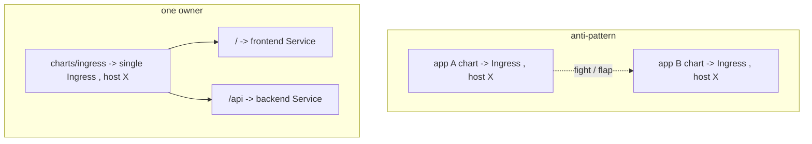

# Single Ingress Ownership

The rule (§1.8, §3.2, SETUP): **one host = one Ingress object = one owner.** Routing lives in a dedicated `charts/ingress`; first-party app charts set `ingress.enabled: false`. The generic chart *can* render its own Ingress (handy for other projects) but doesn't here.

**Why this is a real problem, not pedantry.** It's tempting to let each app chart emit its own Ingress. The failure isn't a Git merge conflict — they're different files in different charts. The failure is at **runtime**:

| Scenario | What happens |
|---|---|
| Two Ingress objects, **same name + namespace** | Both ArgoCD Applications claim the object → they fight → permanent OutOfSync flapping, each sync reverting the other |
| Two Ingress objects, **different names, same host, non-overlapping paths** | Ingress controller merges rules per host — usually fine |
| Different names, same host, **overlapping paths** or host-level settings (TLS, annotations) | Undefined/flaky precedence; one app's annotation silently wins |

So even when it "works," shared host-level config (TLS cert, rewrite annotations, rate limits) has no single owner.



**The owning chart:**

```yaml
# charts/ingress/templates/ingress.yaml — sole owner of host X
spec:
  ingressClassName: nginx
  tls:
    - hosts: ["app.example.com"]
      secretName: app-tls
  rules:
    - host: app.example.com
      http:
        paths:
          - { path: /,    pathType: Prefix, backend: { service: { name: frontend, port: { number: 80 } } } }
          - { path: /api, pathType: Prefix, backend: { service: { name: backend,  port: { number: 80 } } } }
```

**Ingress is not a startup dependency.** It only *routes*; it returns 503 until backing Service endpoints are Ready, then starts working — no need to wave-order it before its backends for correctness, though it's conventionally last ([sync waves](deep:p3-sync-waves)). Same-origin `/api` routing here also dodges the [Vite build-time env](deep:p3-vite-runtime-config) gotcha: the SPA calls a relative `/api`, so no backend URL is baked in.

**Gotchas:** two controllers (e.g. two `ingressClassName`s) for one host; missing `pathType`; `/api` rule typo → 404 on API only (§3.4 Q7); cert/annotation drift when ownership is split. Gateway API (§1.x, [gateway-api](deep:p1-gateway-api)) reframes this with separate `Gateway` (infra owner) and `HTTPRoute` (app owner) resources — explicit ownership by design.

**Interview angle:** "Why not let each app own its Ingress?" Runtime ownership conflict on a shared host (flapping or merged-rule ambiguity), and no single owner for TLS/annotations.
