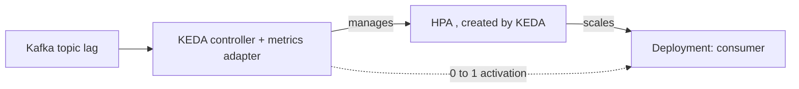

# KEDA ScaledObject and Scale-to-Zero

**KEDA** (Kubernetes Event-Driven Autoscaling, a CNCF **Graduated** project) scales workloads on **event-source metrics** — queue depth, Kafka consumer lag, stream length — not just CPU/memory. It's the right autoscaler for async workers (§3.3 CS4) where CPU is a poor proxy for "work waiting."

**How it relates to HPA.** KEDA doesn't replace the HPA; it **drives** one. A `ScaledObject` makes KEDA create and manage an HPA under the hood, feeding it external metrics via KEDA's metrics adapter. So you get HPA's behavior (stabilization windows, scaling policies) plus event triggers and the one thing HPA can't do alone: **scale to zero**.

```yaml
apiVersion: keda.sh/v1alpha1
kind: ScaledObject
metadata:
  name: order-consumer
spec:
  scaleTargetRef:
    name: order-consumer          # the Deployment
  minReplicaCount: 0              # <-- scale to zero when idle
  maxReplicaCount: 20
  pollingInterval: 30            # how often KEDA checks the trigger (s)
  cooldownPeriod: 300            # wait before scaling 1 -> 0 (s)
  triggers:
    - type: kafka
      metadata:
        bootstrapServers: kafka-bootstrap:9092
        consumerGroup: orders
        topic: orders
        lagThreshold: "100"      # target lag per replica
```



**Scale-to-zero mechanics.** The `0↔1` transition is **KEDA's** job (the "activation" path), because a standard HPA cannot scale below 1 and cannot read a metric from zero pods. Above 1, the **HPA** does the proportional scaling on the external metric. `lagThreshold` is the *target lag per replica*: total lag ÷ threshold ≈ desired replicas (clamped to min/max). `activationLagThreshold` (a separate knob) controls when to wake from zero, avoiding flapping on tiny lag.

**vs HPA on CPU (CS1).** CPU autoscaling (§2.3.3) suits request-serving services where load ≈ CPU. For a queue consumer, lag is the true backlog signal and idle should cost zero pods — exactly KEDA's niche. KEDA ships 60+ scalers (Kafka, RabbitMQ, SQS, Prometheus, cron, Redis lists/streams…). `ScaledJob` (vs `ScaledObject`) spawns a **Job per batch** instead of scaling a long-running Deployment — better for finite work items.

**Gotchas:** scale-to-zero means **cold starts** — first message waits for a pod to schedule + warm; size `cooldownPeriod`/`activation` to avoid thrash on bursty topics. With Kafka, replicas shouldn't exceed topic **partitions** (extra consumers in a group sit idle) — cap `maxReplicaCount` at partition count. KEDA needs the metric source reachable + credentials (via `TriggerAuthentication`). Don't pair a KEDA-managed Deployment with a hand-written HPA — they fight.

**Interview angle:** "Autoscale a Kafka worker, idle to zero?" KEDA `ScaledObject`, `minReplicaCount: 0`, Kafka `lagThreshold`; explain KEDA owns 0↔1 (activation) while the HPA it creates handles the rest, and cap replicas at partition count.
