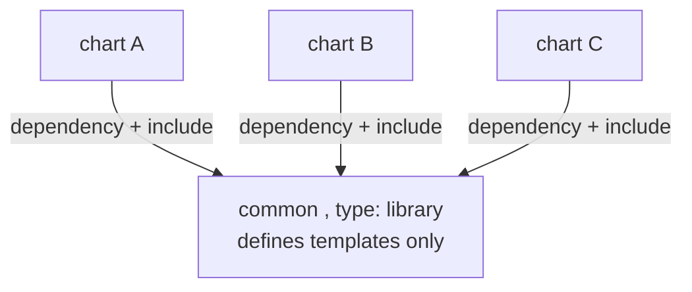

# Library Charts

A **library chart** is a chart with `type: library` in `Chart.yaml`. It ships only `define`d named templates ([`_helpers.tpl`](deep:p3-helpers-tpl) style) and renders **no** Kubernetes objects of its own — `helm install` against it is rejected. Its purpose is to be a dependency that other charts import for shared template logic.

**Why it exists.** The generic chart (§3.2, [generic chart](deep:p3-generic-chart)) handles "many services, same shape, different values." But when several charts need the *same template logic* yet have genuinely different structures, you don't want to copy `_helpers.tpl` between them. A library chart centralizes that logic so each consuming chart calls `include "common.deployment" .` and supplies its differences via values.

```yaml
# common/Chart.yaml
apiVersion: v2
name: common
type: library        # <-- renders nothing on its own
version: 1.0.0
```

```yaml
# consumer/Chart.yaml
dependencies:
  - name: common
    version: 1.0.0
    repository: file://../common   # or an OCI/HTTP repo
```

```yaml
# consumer/templates/deployment.yaml — just delegate
{{- include "common.deployment" . }}
```

The library defines the heavy lifting:

```yaml
{{- define "common.deployment" -}}
apiVersion: apps/v1
kind: Deployment
metadata:
  name: {{ include "common.fullname" . }}
spec:
  replicas: {{ .Values.replicaCount | default 1 }}
  # ... full spec driven by .Values ...
{{- end -}}
```



**Library chart vs generic chart vs subchart.**

| Approach | Renders objects? | Reuse mechanism | Use when |
|---|---|---|---|
| Generic chart + values (§3.2) | yes | same chart, many values files | many near-identical services |
| Library chart | no | `dependencies` + `include` | shared template *logic*, different chart structures |
| Subchart | yes | vendored under `charts/` | bundle a whole component |

The Bitnami `common` chart is the canonical real-world library chart — almost every Bitnami chart depends on it for names, labels, image, and affinity helpers (relevant to the [Bitnami sourcing](deep:p3-bitnami-sourcing) situation, since forks must carry a compatible `common`).

**Gotchas:** bump the library `version` and re-run `helm dependency update` (refreshes `Chart.lock` and `charts/`) or consumers keep the stale copy. A library chart can declare default `values.yaml`, but consumers must still pass scope correctly (`include "x" .`). Template name collisions between library and consumer follow last-parsed-wins — namespace names (`common.*`).

**Interview angle:** "When library chart over generic chart?" Generic = same shape, vary values; library = share logic across charts that differ structurally.
