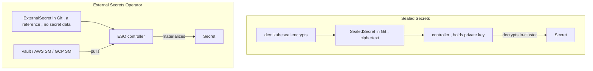

# Sealed Secrets vs External Secrets Operator

GitOps has one rule that fights Kubernetes Secrets: **everything is in Git**, but a Secret is only base64 — *not* encrypted (§2.2). You cannot commit plaintext. Two patterns solve this; they're architecturally opposite.



**Sealed Secrets (Bitnami project).** You encrypt a Secret locally with `kubeseal` against the controller's **public** key, producing a `SealedSecret` CR that is safe to commit. Only the in-cluster controller (holding the **private** key) can decrypt it into a real `Secret`.

| Aspect | Sealed Secrets |
|---|---|
| Secret value lives in | **Git** (as ciphertext) |
| Source of truth | Git |
| External dependency | none (self-contained controller) |
| Rotation | re-seal + commit each change |
| Key risk | the controller's **private key** is the crown jewel; back it up or you can't decrypt; cluster-rebuild loses it |
| Scope gotcha | sealing is namespace+name **scoped** by default — can't move a SealedSecret between namespaces |

**External Secrets Operator (ESO).** Git holds only an `ExternalSecret` CR that *references* a key in an external manager (Vault, AWS/GCP/Azure secret managers). ESO pulls the value and **materializes** a `Secret` in-cluster, refreshing on an interval.

| Aspect | External Secrets Operator |
|---|---|
| Secret value lives in | **external manager** (never in Git) |
| Source of truth | the secret manager |
| External dependency | the manager must be reachable + credentialed |
| Rotation | rotate in the manager; ESO syncs automatically (`refreshInterval`) |
| Key risk | bootstrap creds for ESO→manager; availability of the manager |

```yaml
# ExternalSecret — references, contains no secret data
apiVersion: external-secrets.io/v1
kind: ExternalSecret
metadata: { name: db-creds }
spec:
  refreshInterval: 1h
  secretStoreRef: { name: vault-backend, kind: SecretStore }
  target: { name: db-creds }      # the K8s Secret ESO creates
  data:
    - secretKey: password
      remoteRef: { key: prod/app/db, property: password }
```

**Choosing.** Small team / no secret manager / want Git as the *only* system → **Sealed Secrets**. Already have Vault/cloud SM, need central rotation/audit/cross-cluster sharing → **ESO**. Both render to a normal `Secret` the workload mounts via `envFrom`/volume (§2.2), so the app is unaware.

**Operators publish their own.** Note the capstone's [CloudNativePG](deep:p3-cloudnativepg)/[Strimzi](deep:p3-strimzi) operators **generate** credential Secrets directly — for those you consume the operator's Secret rather than managing one.

**Gotchas:** Sealed Secrets private-key loss = unrecoverable secrets (back it up off-cluster); ESO outage means stale/missing Secrets and pods can't start; neither encrypts etcd at rest — pair with [encryption at rest](deep:p2-encryption-at-rest); ArgoCD diffing a materialized Secret can show noise (ignore-differences on `data`).

**Interview angle:** "Secrets in GitOps?" Sealed Secrets (ciphertext in Git, controller decrypts) vs ESO (reference in Git, pulled from a manager) — Git-as-truth vs manager-as-truth, and the respective single points of failure.
